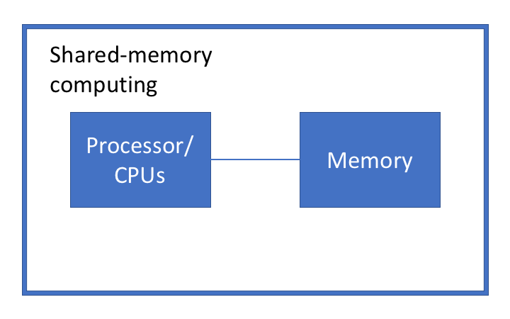

```{r xaringan-tile-view, echo=FALSE}
xaringanExtra::use_tile_view()
```


## Outline

- Basics about computing

- R and how are we going to use it

- Reproducibility

---
class: big, middle

# Basics about computing

---

## Hardware architecture
.center[

]

- processor: does the actual computation
- memory: intermediate capacity storage, temporary, fast to read and write
- hard drive: large capacity storage, store your files, slow to read and write

---

## Operating systems
.center[

    Source: [Computer Science wiki](https://computersciencewiki.org/images/0/0d/Os_family_tree.png)
]

- Most large-scale scientific computing is performed on Linux platforms
- We will learn the full monty using either Windows/MacOS/Linux

---

## Shells and kernels

.center[

    <br/><br/>[Source](https://bash.cyberciti.biz/guide/What_is_Linux_Kernel)
]

- A *kernel* consists of low-level programs that manage the operation of hardware
- A *shell* is either a graphical user interface (GUI) or text-based user interface (TUI) to the system services

---

## File paths

A *path* is a string of characters specifying the location of a file. Programs use it to find files/commands/libraries


- On MacOS & linux, "/" separates parent/child directories. E.g.,  
    ```
    /Users/xdai/test
    /                               (the root directory)
    ```

- On Windows, "\\" is the path separator, but R uses "/" as well:
    ```
    D:\Research\program\toy.m       (used by File Explorer)
    E:/Programs/MRO/R-3.2.3/bin/x64 (used by R)
    ```
    
- We will be using "/" throughout

- Many bugs are due to path misspecification!

---

## Current working directory

```{r, include=FALSE}
knitr::opts_knit$set(root.dir = '~/Downloads')
```

- Most programs have a *(current) working directory*
    - "where you are"
    - different programs have different working directories

- In R console, `getwd()` shows the working directory
    ```{r}
    getwd()
    ```
    
- So `read.csv('input.csv')` is going to read the file in the folder shown above


---

## Absolute and relative paths

- An *absolute path* is the location of a file on the hard disk. An absolute path always starts with an `/`. E.g., `/` (the root folder), `/Users/xdai`, `/mnt/c/My Documents`
    - Avoid absolute path in your code because they make the code non-reproducible
    
- A *relative path* is the location of a file relative to the current working directory. E.g., 
    - `.` (current directory), 
    - `..` (parent directory), 
    - `input.csv` (`input.csv` in the current directory), and 
    - `../documents/input.csv` (`input.csv` in the `documents/` folder located in the parent directory)
    
---

## Basic file types

*Pure text files* contains only human-readable characters. 
  - Include code files. E.g., `test.R`, `train.py`, `Makefile`
  - Can be edited using a text editor: e.g., RStudio, Visual Studio Code, notepad++, sublime, vim, emacs, etc
  - Good for tracking changes in code

A *binary file* is anything but a text file
  - E.g., `syllabus.pdf`, `save.RData`

---
class: big, middle

# R and how are we going to use it


---

## Why R

- The community

    * One of the most popular data science/statistical programming languages
    
    * __Free__  and  __open source__ 
    
    * __Extensible__: 18000+ packages on CRAN, 2000+ on Bioconductor, and many more on github

* __Powerful__ for data analysis

- R is intuitive

    - R functions are like functions in math. So `cos(x)` means "give me the value of the cosine of `x`", and it is not going to modify `x`

    - R counts from 1 (unlike Python & C++ which count from 0)

```{r, eval = FALSE, echo = FALSE}
devtools::install_github("metacran/crandb")
pkgs <- crandb::list_packages(limit = 999999)
length(pkgs)
# [1] 15352
```

---

## How are we going to use R

- R

- Integrated development environments (IDEs)

    - RStudio

    - (Optional) Other IDEs: [Visual Studio](https://docs.microsoft.com/en-us/visualstudio/rtvs/?view=vs-2017), [Nvim-r for vim](https://github.com/jalvesaq/Nvim-R), and [ESS for emacs](http://ess.r-project.org/). 

- Remotely

    - (Optional) [DataHub](https://datahub.berkeley.edu/) which give you RStudio, bash, and Jupyter notebook access (by UC Berkeley’s Data Science Education Program)

    - on savio (later)

---
class: big, middle

# Reproducibility

---

## Reproducibility 

American Statistical Association [defines](https://www.amstat.org/news-listing/2021/10/11/asa-develops-reproducible-research-recommendations):

- *Reproducibility*: A study is reproducible if you can take the original data and the computer code used to analyze the data and reproduce all of the numerical findings from the study.

--

- *Replicability*: This is the act of repeating an entire study, independently of the original investigator without the use of original data (but generally using the same methods).

---

## How to conduct reproducible analysis

The key is to have a piece of code file that give *all* the analysis without user interaction.

Here are some common ways to achieve that

- R code file + writeup

- Rmarkdown (R + Markdown)

- Rnw (R + LaTeX)

- Jupyter notebook

*Your homework and project submissions are expected to be reproducible*

---

class: big, middle

## RMarkdown

---

## Markdown

- `Markdown` is a particular type of **markup** language.

- Markup languages are designed to **produce documents from plain text**

    ```
    *italic*
    **bold**
    
    # Header 1
    ## Header 2
    
    - List item 1
    - List item 2
        - item 2a
        - item 2b
    
    1. Numbered list item 1
    1. Numbered list item 2
        - item 2a
    ```

- You can type an equation inline. E.g., `$y = \beta_1 x^2$` is rendered as $y = \beta_1 x^2$

    - More in this [quick guide](https://rpruim.github.io/s341/S19/from-class/MathinRmd.html)

---

## Built upon Markdown: RMarkdown

- RMarkdown is an authoring format that enables easy creation of dynamic documents, presentations, and reports from R 

- It combines the core syntax of markdown with embedded R code chunks that are run so their output can be included in the final document.

- R Markdown documents are reproducible. They are generated as if you just start up R.

- Click File -- New File -- RMarkdown -- OK to create a new RMarkDown file. Knit it, and play with the template.

- This [R Markdown Reference Guide](https://www.rstudio.org/links/r_markdown_reference_guide) visualizes how RMarkDown code will be rendered
