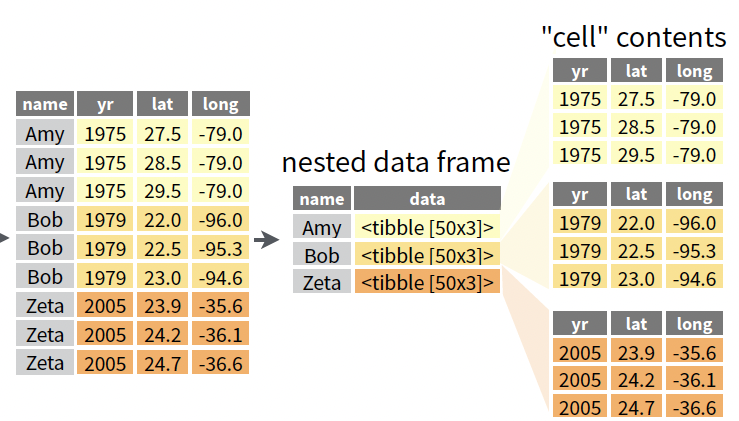

```{r xaringan-tile-view, echo=FALSE}
xaringanExtra::use_tile_view()
```

## Outline

- Applying functions repeatedly

- `do.call`

- Applying functions by group

- Reduce

---

## Why functional programming

<!-- (For the following code to run, download [1.csv](1.csv), [2.csv](2.csv), and [3.csv](3.csv) and put them side-by-side your R script. Remember to set the working directory to the source file location) --> 

- Functional programming is clear and concise. E.g., to read in several files in 
```
files <- c("1.csv", "2.csv", "3.csv")
```

```{r, include=FALSE, eval=FALSE}
purrr::iwalk(unname(split(iris, iris$Species)), ~write.csv(.x, paste0(.y, ".csv")))
```

.pull-left[
Functional style
```
lapply(files, read.csv)
```
]

.pull-right[
Procedural style
```
results <- vector("list", 
                  length(files))
for (i in seq_along(files)) {
  results[[i]] <- read.csv(files[i])
}
```
]

- A functional programming style is great to use for programming statistical/mathematical methods

- .style[You may think you can do everything using loops. But functional programming allows us to scale to large data/computation]

    - E.g., [map-reduce framework](https://www.educative.io/cdn-cgi/image/f=auto,fit=contain,w=2400/api/edpresso/shot/4555060823457792/image/5578380452823040.png) 

---
class: big, middle

## Applying functions

---

## `purrr`

- We will be using the functional programming library `purrr`

- `purrr` is a more complete and consistent set of tools to enhance R’s `sapply`, `mapply`, `Reduce`, etc

<!-- - Load the library using --> 
    ```{r, include=FALSE}
    library(purrr)
    ```

---

## Applying a function to different inputs

`map(.x, .f)` applies the function `.f` to each entry in `.x`

.center[

</br>Figures are due to [Hadley Wickham](https://adv-r.hadley.nz/functionals.html)
]

- `map` always returns a list
- The input `.x` may be a list or a vector
- The output of `.f` can be anything

```{r, collapse=TRUE}
x <- list(c(1, 2, 3, 10), 2:3)
map(x, mean)
```

---

- You can define an arbitrary function and use it with map.

```{r}
standardize <- function(v) {
	(v - mean(v)) / sd(v)
}
map(x, standardize)
```

- You can use an *anonymous function* to perform short tasks that do not warrant names

```{r, eval=FALSE}
map(x, function(v) (v - mean(v)) / sd(v))
```
or
```{r, eval=FALSE}
map(x, function(v) { # calculate the 2nd moment
  v2 <- v^2
  mean(v2)
})
```

---

## Returning atomic vectors

<!-- - You can convert a list of scalars to a vector using `unlist` -->

- To be more rigorous, use `purrr` functions that returns a *scalar* of specific types when possible:

    ```
    map_dbl(.x, .f) # double-precision floating number
    map_int(.x, .f) # integer
    map_lgl(.x, .f) # logical
    map_chr(.x, .f) # character
    ```

- The usages of these functions are the same as `map()`, except that the output of your function `.f` must be a scalar

- The output of `map_***` is guaranteed to be a vector of the specified type

---


```{r}
map_dbl(x, mean)
```

If the result of `.f` is not a scalar, you will have an error
```{r, error=TRUE}
map_dbl(x, summary)
```

Use `map` if `.f` outputs vectors of different types or with length > 1
```{r, error=TRUE}
str(map(x, summary))
```

---

## `do.call`

`do.call(f, aListOfArgs)` executes `f` using arguments in `aListOfArgs`

- E.g., good for plotting and combining results

```{r, eval=FALSE}
do.call(cbind, list(a=1:3, b=4:6)) # same as cbind(a=1, b=2)
do.call(plot, list(1:10, col="red")) # same as plot(1:10, col="red")
```

---

## Passing optional arguments

```
map(.x, .f, ...)
```

You can specify optional arguments to your function `.f` using `...`

.center[

]
```{r}
y <- list(c(NA, 1:5), 2:3)
map(y, mean, na.rm=TRUE)
```

---
class: inverse

## Your turn

Start with a list
```
l <- list(c(1, 3, 5, 100),
          c(NA, 3, 5, 100),
          c(NA, 1:10, 100))
```

- Find the sum of the values in each entry of `l` using `map`. It is OK to have `NA` values in your result

- Find the sum of the values in each entry of `l`. The returned value should be a numeric vector (but not a list) this time

- Redo the last bullet, but this time remove missing values

---

## Nested maps
Suppose that we want to find the trimmed means of entries x, and try either no trimming or 30% trimming.

```{r}
map(x, function(xx) {
  map_dbl(c(0, 0.3), function(trim) mean(xx, trim=trim))
  # same as: map_dbl(c(0, 0.3), mean, x=xx)
})
```

---

## Other variants of `map`

- `walk(.x, .f)` calls `.f` for its side-effect (making plots, save files, etc) but not for returning new results

- `imap(.x, .f)`, `imap_dbl`, `imap_chr`, `iwalk`, etc 
  - iterate over `.x` with an index (either an integer position or a name, depending on whether `.x` is named). E.g.,
    ```{r}
    imap(x, function(x, i) {
      stringr::str_c("Field ", i, " has mean ", mean(x))
    })
    ```
---

## Map and vary 2 inputs

`map2(.x, .y, .f)` applies the function `.f` to each parallel pair of entries in `.x` and `.y`


.center[

]

```{r}
map2(x, 
     c("Male", "Female"), 
     function(v, name) paste0(name, ": ", mean(v)))
```

---

## Map and vary p inputs


`pmap(.l, .f)` applies `.f` to each parallel collection of entries in `.l`


.center[

]

```{r, collapse=TRUE}
l <- list(
  c(1, 6),
  c(4, 3),
  c(2, 5)
)
pmap(l, function(a, b, c) seq(a, b, length.out=c))
```

---
## More variants with >1 inputs

- `map2_dbl`, `map2_chr`, `map2_lgl`, `walk2` etc are also available to map over 2 arguments

- `pmap_dbl`, `pmap_chr`, `pmap_lgl`, `pwalk` etc are also available to map over multiple arguments

---
class: inverse

## Your turn

Start with a list
```
l1 <- list(1, 2, 3)
l2 <- list(1, 2, 3)
l3 <- list(1, 2, 3)
```

- Use `map2` to multiply the numbers in `l1` and `l2` *entrywise*

- Use `pmap` to multiply the numbers in `l1`, `l2`, and `l3` *entrywise*

---

## Calling a function by group

- `split(x, f)` separates a vector/data frame `x` according to a factor `f` and returns a list of data frames, each corresponding to one group

```{r}
sLenBySpecies <- split(iris, iris$Species)
summary(sLenBySpecies)
```

- We can then apply the `map` function and friends to the grouped data
```{r}
map_dbl(sLenBySpecies, function(dat) sum(dat$Sepal.Length))
```

- This approach is more flexible than `dplyr` since you can apply a very complex function

---

## Nested data frame/list column

The map functions work very nicely with nested data frame, namely, within a master data frame, a column contains a list of data frames.

.center[
</br>
[tidyr cheat sheet](https://github.com/rstudio/cheatsheets/blob/main/tidyr.pdf)
]


---

```{r, message=FALSE}
library(gapminder)
library(dplyr)

nested <- gapminder %>%
  group_by(country, continent) %>% 
  tidyr::nest()
head(nested)
```

---

```{r}
dat1 <- nested %>%
  mutate(
    mod = map(data, function(dat) lm(lifeExp ~ year, dat)), 
    beta = map_dbl(mod, function(m) coefficients(m)['year'])
  )

filter(dat1, beta < 0)
```

---

class: big, middle

## Reduce and accumulate

---

## Reduce

- *Reduce* means aggregating intermediate results 

- the `reduce` function in `purrr`:
.center[

]

- E.g, sum up the numbers of (patients, expenditure)
    ```{r, collapse=TRUE}
    l <- list(CA = c(2, 1), NV = c(3, 3), UT=c(5, 2))
    reduce(l, `+`)
    ```

- `.init=` specifies the initial value before any combination

- `.dir=` specifies the direction of reduction

---

## Accumulate

`accumulate` works like `reduce`, except that `accumulate` keeps all intermediate combined results

```{r}
accumulate(l, `+`)
```

---

## References

- Chapters 9, [Advanced R](https://adv-r.hwadley.nz/index.html) by Hadley Wickham

- Chapters 25, [R for Data Science](https://r4ds.had.co.nz/many-models.html) by Hadley Wickham
