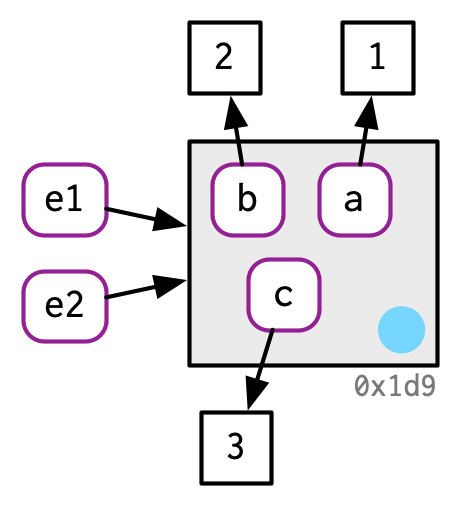
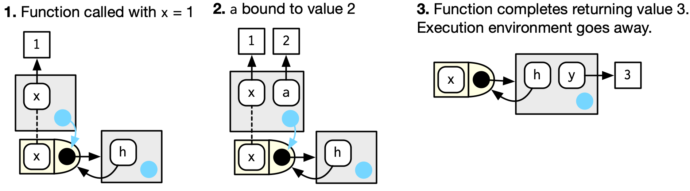
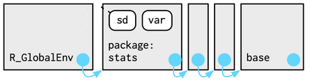

```{r xaringan-tile-view, echo=FALSE}
xaringanExtra::use_tile_view()
```

## Outline

- Environments in R

- R scoping mechanism

- Environments in R packages

---
class: big, middle

## Environment basics

---

## Binding values

- R objects are pieces of data floating in your computer memory

- When you create `x <- c(1, 2, 3)`, 
    - R allocates a piece of memory to store the values `c(1, 2, 3)`
    - R *binds* the variable name (symbol) `x` to that value
    - The same value may have multiple bindings

.center[

</br>Figures are due to [Hadley Wickham](https://adv-r.hadley.nz/)
]

- Similarly, a data frame `d1 <- data.frame(x = c(1, 5, 6), y = c(2, 4, 3))` behaves like 
.center[

]

---

## Environment in R

An environment is a container of variables behaving somewhat like a list: 

- Use `$` or `[[` to set/modify/extract an element by name

... except that

1. Environments follow a reference semantics (not copied when modified)

1. An environment has a parent

1. Names must be unique

1. Names are not ordered (hash table)

---

## 1. Reference semantics

- R most of the time refers to objects by value, so `x` and `y` are different
    ```{r}
    x <- c(1, 2, 3)
    y <- x

    y[[3]] <- 4
    x
    y
    ```

---

- Environments in R, however, follows a *reference semantics*
    ```{r}
    e1 <- rlang::env(a = 1, b = 2, c = 3)
    e2 <- e1
    ```

.center[

]

```{r}
e1$c <- 4
e2$c
```

.center[

]

---

- Environments are not copied when modified. Names bound in the environment will always operate on the same object without copying it.
    ```{r, error=TRUE}
    f <- function(e) {
      e$a <- 100
      stop("Don't return")
    }
    f(e1) # on the other hand, if you input a list, it gets copied
    e1$a
    ```

---

## 2. An environment has a parent

- Every environment has a parent, which is again an environment

- The parent of an environment is where the latter is defined

```{r}
library(rlang)
env_print(e1)
# Unnamed input to `env()` specifies the parent
e1$anEnv <- env(e1, d=1) 
env_parent(e1$anEnv)
```

---

- When R looks for a variable in an environment, it looks at the bindings in the environment, and then its parent environment, and so on
    ```{r}
    a <- 0
    get("a", envir=e1)
    # No binding called x exists in e1
    get("x", envir=e1)
    ```

- Environment having a parent is very different from a list nested in another list

---

3\. Names in an environment must be unique

```{r}
e3 <- env(a=1, a=2) # Not useful
env_print(e3)
```

4\. Names are not ordered

```{r, error=TRUE}
e1[[1]]
```
---

## Some important environments

- The *global environment* `globalenv()` is where the variables and functions are stored if you evaluate code in the R console

- The current environment `current_env()`  show the current environment. Useful for interactive exploration

- The *empty environment* `emptyenv()` is the only environment that does not have a parent

---

class: inverse

## Your turn

- Create a new environment named `env1` using `env()`. It should contain variables `a = 1`, `b = "ha"`, and `c = TRUE`

- Create a new environment `env2` which should have parent being `env1`. Add a variable `a = 2` into `env2` (Hint: `env(env1, var=value)` does this)

- Remove variable `b` in `env1`. Try setting it to `NULL` and see if it works. Then try `env_unbind(env1, "b")` 

- Get values `a` and `c` in `env2` using `get(varName, envir=)`

---

## When environment is useful as a data structure

Environments can be used to

- avoid accidental copies of large data (actually, when a list is copied, R usually makes a shallow copy of only the references to the list elements so that is not super costly either)

- manage states within a function or a package

- as a hash table (may get back to this when we talk about algorithms)

---
class: big, middle

## Mechanism for the scoping rules: Environments

---

## The function environment

The environment of a function, called the *function environment*, is the environment where the function is defined. E.g., for 

```
y <- 1
f <- function(x) x + y
```

.center[

]

- Black arrow indicates function environment

- Function environment (and its chain) defines how global variables should be found in this function

---

## The excecution environment

- Every time a function is called, a freshly created environment called the *execution environment* will be created (fresh starts)

- The body of the function will be evaluated in the encapsulated execution environment (where local variables are defined)

- The parent of the execution environment is the function environment (so global variables are found)

- The execution environment goes away if it is not referred to after the function returns (local variables go away)

---

## Example 1: Function call

```{r}
h <- function(x) { 
  a <- 2 
  x + a
}
y <- h(1) 
```
.center[

]

---

## Example 2: Find a global variable

```
y <- 1
f <- function(x) x + y
f(2)
```

</br>
</br>
</br>
</br>
.center[

]

---

## Example 3: Function factory

```{r, collapse=TRUE}
plus <- function(x) {
  function(y) x + y
}

plus_one <- plus(1)
```

.center[

]

- An anonymous function is generated in the execution environment of `plus(1)`, which becomes its function environment
- Later, the anonymous function is bound to `plus_one` in the global environment

---

## Example 3 cont.

```{r, collapse=TRUE}
plus_one
plus_one(2)
```

.center[

]

- When `plus_one` is executed, the execution environment has a parent function environment that contains `x`

---

## Caution: Forced evaluation

There is a subtle bug in `plus()` due to lazy evaluation
```{r}
plus <- function(x) {
  function(y) x + y
}
a <- 2
plus_two <- plus(a)
a <- -2
plus_two(2)
```

- You wish the output is 4
- This is not the case because of lazy evaluation
- The value of `a` is unevaluated when `plus_two` is defined; and `a` is bound to `plus_two` only at the first time `a` is refered to, at which moment `a` equals -2

---

- To fix the issue, use `force()` to *force evaluate* the argument `x` before the function factory returns. The corrected function is

```{r}
plus_v2 <- function(x) {
  force(x)
  function(y) x + y
}
a <- 2
plus_two <- plus_v2(a)
a <- -2
plus_two(2)
```

---

class: big, middle

## Environments in R packages

---

## The search path

- R finds a function in a package by following the `search path`
    ```{r}
    search()
    ```

- R attempts to finds a function in the first path, if not found, the next one, and so on

- This behavior is implemented by environments. R finds the `sd` function when you type it in the console, which does not exist in the global environment:

.center[

]

- The order of the attached packages (environments) is also known as the *search path*. See `search()`

---

## Package environment and namespace environment

- The package environment is the interface to the package exposed to the users. You see functions in this environment using `pkg::fun`

- The namespace environment is the internal environment to the package, not supposed to be accessed by users. You can still access the functions using `pkg:::fun`


---

Why a user-defined `var()` won't break `stats:sd()`:

```{r}
var <- function(x) stop()
sd(1:3)
```

.center[

]

---

## References

- Chapters 7 and 10, [Advanced R](https://adv-r.hadley.nz/index.html) by Hadley Wickham
