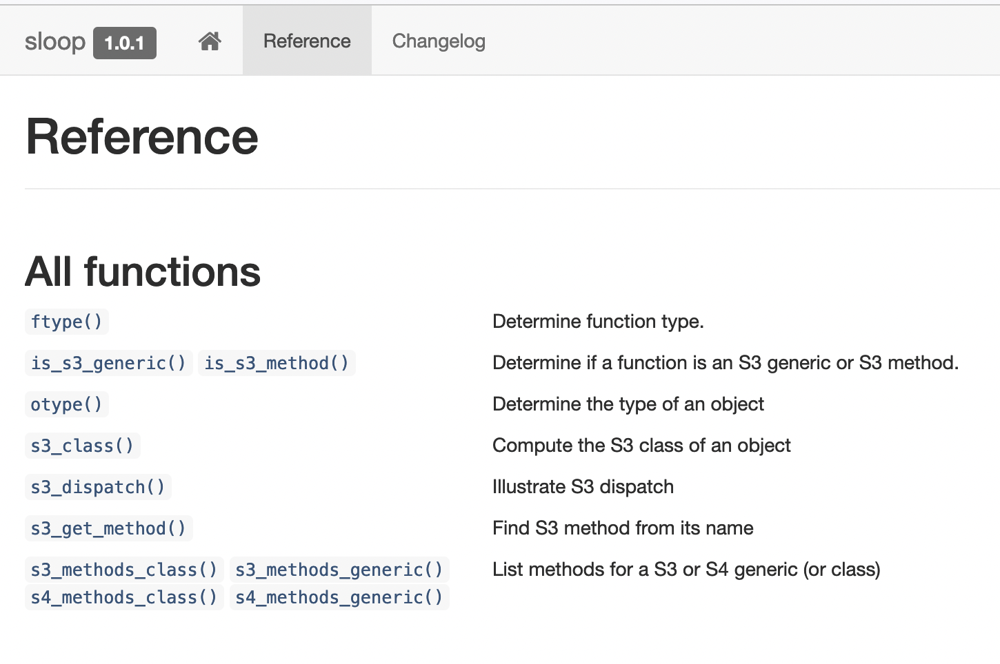

```{r xaringan-tile-view, echo=FALSE}
xaringanExtra::use_tile_view()
```

## Outline

- Object-oriented programming

- The S3 system

---

class: big, middle

## Object-oriented programming

---


## Object-oriented programming

- Object-oriented programming (OOP) is a programming paradigm that organizes code by centering around objects

- A *class* definition describes the common *data* shared by objects belonging to this collection, and *allowable operations* on these objects

---

## Benefits of OOP

- Encapsulation/abstraction: Users can use a method for the class (e.g., plot a model) without knowing the details about how the class is constructed

- Inheritance/do it once (DRY): Write one method function and it will work for many related classes

---

## OOP systems in R

- S3, the simplest and most common OOP system in base R. Easiest to write and use, but also easy to break

- S4, a more rigorous and featureful system than S3. Used extensively by the Bioconductor project

- R6, a reference class system to avoid copying an object. Useful for modeling something that should have only a single copy (e.g., an external database)

---

## Why to use OOP

- Ubiquitous in R, we need to be able to use it

- Great way to organize code

- Be able to develop it

---

class: big, middle

## S3

---

## Some terminologies

- The *class* of an object describes what type is it
    ```{r}
    mod <- lm(extra ~ group, sleep)
    class(mod)
    ```

- The *fields* in a class defines the common data possessed by every instance/object of that class. E.g., `$coefficients`, `$residuals`, etc always exist in an `lm` object

- A *generic* is a function that defines the interface for a job. E.g., `print` behaves differently depending on the class of the first input
    ```{r}
    print
    ```

---

- A *method* for a class is a function specifically designed for that class (`lm` here). In S3, method function names ends with `.className`
    ```{r}
    args(stats:::print.lm)
    ```

---

- The process of finding the right method to apply for a class is called *method dispatch*
    ```{r}
    print(mod)
    ```
    ```{r}
    modList <- unclass(mod)
    print(modList)
    ```

---

- Classes may follow a hierachy. A *subclass* (child class) will inherit the data structure and methods defined by its parent class

- In S3, subclass appears before the parent class(es)
    ```{r}
    gmod <- glm(extra ~ group, sleep, family=gaussian)
    class(gmod)
    ```

---

## `library(sloop)`

- We will be using `r library(sloop)` for inspecting S3 objects and methods  

- (Think: Sail the OOP) </br>




---

## Creating S3 objects 

- There is no rigorous class definition

- Suppose that we want to create a `patient` class. The class should contain ID and patient name

- There are different ways to build the class, but the key is to set the `class` attribute. We build a patient class upon a numeric object and add patient name `pname` as an attribute
    ```{r}
    # A toy example
    p1 <- 312
    attr(p1, "pname") <- "Max"
    class(p1) <- "patient"
    p1
    ```

---

- Better yet, create a constructor function to build an object

```{r}
NewPatient <- function(ID, pname) {
    structure(ID, 
        pname = pname,
        class = "patient"
    )
}
p2 <- NewPatient(93, "Kate")
```

---

- The constructor can incorporate some sanity checks. If the checks are costly, it makes sense to move the check into a separate validator function

```{r,error=TRUE}
NewPatientWithCheck <- function(ID, pname) {
    stopifnot(ID > 0)
    stopifnot(is.character(pname))

    structure(ID, 
        pname = pname,
        class = "patient"
    )
}
p3 <- NewPatientWithCheck(-1, "Penny")
```

---

## Designing a base class

- When designing a class, should I build on a numeric vector/matrix, a list, or a data frame as the *base class*?

- The choice of base class shouldn't matter to analytic users by the principle of encapsulation, so it is a matter for the developer in terms of speed and ease of implementation

- Attributes should not carry too much information, since they are prone to be lost

- Numeric vectors/matrices are fastest to do arithmetics, so they are the preferred choice if efficiency is a consideration

---

## Subclass

Let's consider a new in-patient class. An in-patient is a patient (share the fields of the latter) but should also have a DOA (date of admission) field

- We should modify the constructor
    ```{r}
    NewPatient2 <- function(ID, pname, ..., subclass=character()) {
        structure(ID, 
            pname = pname,
            ..., 
            class = c(subclass, "patient")
        )
    }
    p4 <- NewPatient2(123, 
        "Novak", 
        DOA = as.Date("2022/01/02"), 
        subclass="in-patient")
    class(p4)
    ```

---

## S3 generic

You can use existing generics (`print()`, `plot()`, etc) or define new ones:

```{r}
DaysInHospital <- function(x, ...) {
    stopifnot(x > 0) # validation, etc
    UseMethod("DaysInHospital")
}
```

- Always include `...` in the generic since method functions may have additional optional arguments

- `UseMethod("GenericName")` starts the method dispatch

- Code written after `UseMethod()` will not be evaluated

---

## Method dispatch

- `UseMethod()` works by trying to use the following in sequel
    - the most specific method for the subclass;
    - a method for the parent class, and so on; 
    - the default method;
    - or throw an error

- S3 method dispatch is based on the class of the first input to the generic
    ```{r}
    s3_dispatch(print(p4))
    ```

---

## Creating methods

- A method is named `genericName.className()` 

- An example:

```{r}
print.patient <- function(x) {
    writeLines(sprintf("Patient %d is %s", x, attr(x, "pname")))
    invisible(x)
}
print(p1)
s3_dispatch(print(p2))
```

---

```{r, error=TRUE, warning=FALSE}
`DaysInHospital.in-patient` <- function(x) {
    Sys.Date() - attr(x, "DOA")
}
DaysInHospital(p4)
DaysInHospital(p1)
```

---

- A method should have the identical first argument name as the generic, or otherwise it could be very confusing behavior is going to arise

- A bad example, where the first argument name of the method does not match that of the generic

```{r, warning=FALSE, error=TRUE}
t1 <- t.test(extra ~ group, sleep) # works
t2 <- t.test(formula=extra ~ group, sleep) # does not
```

---

## `NextMethod()`

- `NextMethod()` can be used to avoid duplication of code. Suppose that a generic function needs to do slightly more when given a subclass than its parent class

- It is going to capture the current call frame and evaluate the next method using the same inputs

- E.g., given an in-patient, print it like what is done for a patient, but also print the DOA
    ```{r}
    `print.in-patient` <- function(x) {
        NextMethod()
        writeLines(sprintf("DOA is %s", attr(x, "DOA")))
        invisible(x)
    }
    print(p4)
    ```

---

class: inverse

## Your turn

Create a new subclass `ICU-patient` which should be a subclass of `in-patient`. This subclass should include a further field `reason` for the reason of admittance.

- Create a ICU-patient object `p5` using `NewPatient2()`. Make sure to the class is `c("ICU-patient", "in-patient", "patient")`, and also make sure the object has `pname`, `DOA`, and `reason` fields. 

- Run `print(p5)` and what you get. Use `s3_dispatch(print(p5))` to reason about the the method dispatch

- Implement the `print.ICU-patient()` method, which should print out the reason in addition to other information. Then redo the last step

```{r, include=FALSE, eval=FALSE}
p5 <- NewPatient2(555, 
    "Jack", 
    reason="stroke", 
    DOA = "1965-10-30",
    subclass = c("ICU-patient", "in-patient"))
print(p5)
`print.ICU-patient` <- function(x) {
    NextMethod()
    writeLines(sprintf("Admitted because of %s", attr(x, "reason")))
    invisible(x)
}
print(p5)
```


---

## One more example

Suppose we have proposed a new "Tremendous Regression". The following function returns an `tm` object, which is a subclass of an `lm` model

- Needs a function to construct the class
    ```{r}
    tm <- function(...) {
        res <- lm(...)
        class(res) <- c("tm", class(res))
        res
    }
    fmod1 <- tm(extra ~ group, sleep)
    ```

- Generics like `plot()`, `print()`, `coef()` works right out of the box thanks to S3 method dispatch

---

- Reimplement a more specific method for an existing generic
    ```{r}
    print.tm <- function(x, ...) {
        cat(sprintf("Fitting: %s\n\n", deparse(x$terms)))
        cat("Coefficients:\n")
        print.default(coef(x))
        invisible(x)
    }
    fmod1
    ```

---

- Implement a new generic
    ```{r}
    present <- function(x, ...) {
        UseMethod("present")
    }
    ```

- ... and a method
    ```{r}
    present.tm <- function(x, ...) {
        print(x)
        writeLines(praise::praise())
        invisible(x)
    }
    present(fmod1)
    ```

---

## Example use of S3 in packages

- [`caret`](https://cran.rstudio.com/web/packages/caret/), wildly popular for classification and regression training

- [`RFPCA`](https://github.com/CrossD/RFPCA), for Riemannian and multivariate functional data analysis


---

## Issues for the S3 system

- Attributes are prone to be lost when using `[` and `c`, so it is hard to reset the class vector and other attributes
    ```{r,eval=FALSE}
    `[.patient` <- function(x, i) {
        x[i] # won't work
    }
    ```

- Must call the generator again
    ```{r}
    `[.patient` <- function(x, i) {
        res <- NewPatient2(NextMethod(), pname=attr(x, "pname")[i])
        res
    }
    p5p6 <- NewPatient2(c(555, 666), c("Jack", "Mary"))
    p5p6[2]
    ```

- Tedious to make it work for subclasses. S4 is more consistent in terms of inheritance

---

## References

- Chapters 12 and 13, [Advanced R](https://adv-r.hadley.nz/index.html) by Hadley Wickham
