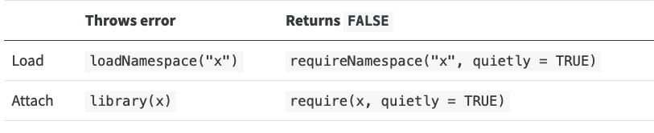

```{r xaringan-tile-view, echo=FALSE}
xaringanExtra::use_tile_view()
```

## Outline

- Why R packages

- A barebone package

- More on R packages


---

## References

- [R packages](https://r-pkgs.org/) by Hadley Wickham and Jenny Bryan

- R manual [Writing R Extensions](https://cran.r-project.org/doc/manuals/r-devel/R-exts.html)

- [roxygen2 documentation](https://roxygen2.r-lib.org)

---

## Why to write an R package?

- R package is a great way to share R code
    - via CRAN, Bioconductor, or GitHub, and more

- Even if you are the only user of your code, it is a great way to organize code

    - An R package provides a useful structure to bundle the source code, test files, manuals, etc
    - Formalize many aspects of your code, like dependency, versioning, and license
    - R offers checks for potential issues in packages

- Makes your code more reliable and reusable

---

## Who should write an R package

- Everyone should!
    - Good for a reasonably large project where the code is expected to be developed and maintained over more than a few weeks
    - Even if your code involves an analysis only -- you can create an R package for the repeated tasks

- Especially true if you develop biostatistical methods or utility tools

---

## A barebone R package

- It is simple to make an R package

- An R package is not much more than a folder structure:
```
myPackage/
|--DESCRITION
|--NAMESPACE
|--R/
|--...other files...
```

- Create an R package where you would create a folder for a new project
    - But don't nest an R package within another

---

## General process to get started

1. Create a package skeleton using
  ```{r, eval=FALSE}
  usethis::create_package("path/to/package")
  ```

1. Move R code into `R/`

1. Edit `DESCRIPTION`

1. In an analysis file, issue `devtools::load_all(path/to/package)`. Your R functions will be ready to use


---

class: inverse

## Your turn

- Create a package skeleton using `usethis::create_package()`

- Put your code for comparing linear models (from HW1) in `R/`

<!-- - Edit the DESCRIPTION file -->

- In a separate `analysis.R` file outside of the package. 

    - Load your package using `devtools::load_all()` (supply the correct path)

    - Write some analysis code 

---

## A quick overview of components

Take the [`fdapace`](https://github.com/functionaldata/tPACE) as example, which implement methods for functional data analysis:

- `DESCRIPTION` describes basic metadata about the package, e.g., package name, title, description, authors/maintainer/contributors, license, dependencies, etc

- `NAMESPACE` specifies what functions your package makes available to users and what functions from other packages it depends on. Generated automatically by Roxygen2

- `R/` includes the `.R` files, mainly containing functions

- `tests/` contains all the unit test files

- `man/` contains the documentations. Generated automatically by Roxygen2

---

## More components...

- `data/` contains the data shipped with the package

- `vignettes/` contains the vignette files

- `inst/` for other files that will be installed with the package

- `src/` contains the sources files for the compiled code (e.g., C/C++)

---

## Loading and attaching a library

- We will be a little bit careful about what it means by *loading* and *attaching* a library in this lecture

- When you *load* a package, the functions, manuals, and dynamic libraries are loaded into memory
    - Functions can be found using `pkg::func`

- When you *attach* a package, you are attaching the package environment to your search path (recall [search path](09_environments.html#search-path))
    - After attaching, you can find a function by typing its name in the R concole

.center[

]


---

## DESCRIPTION: Specifying dependency

`Imports:`, `Suggests:`, and `Depends:` specify what packages does yours depend on, to different extents

- `Imports:` specifies packages being depended upon by your functions. These packages will be loaded but not attached when your package is attached. Most dependency should belong here

- `Depends:` specifies packages being depended upon by your functions. These packages will be loaded and attached when your package is attached. Only very few packages that ought to be used together with yours should be attached

- `Suggests:` specifies optional packages that enhances the use of yours. These packages do not need to be installed

---

## DESCRIPTION: Versions

- Version: Usually go by `major.minor.patch` (e.g., `4.2.1`)

- Development versions have a fourth component (e.g., `0.0.0.9001`)

- Your package can depends on a package with a certain version, e.g., `dplyr ( >= 1.0.0 )`; or a certain R version, e.g., `R (>= 3.5.0)`

---

## License

- Who writes the code usually holds the copyright

- The copyright holders can determine how others may use their code through *licenses*

- Using a license helps others to use your code

- There are primarily two types of licenses for open source software

  - *Permissive licenses* impose minimal restrictions. Users can usually freely use, modify, and distribute the code provided they make available a copy of the license. E.g., MIT, Apaches, and various BSD licenses. Python is released under a permissive license

  - *Copyleft licenses* require the users not to take way the freedom of their downstream users. Software developed upon copyleft code cannot be close-sourced. E.g., GPL 2, GPL 3, and Creative Commons licenses. R is released under GPL

- Two licenses are said to be *compatible* if there is a legitimate way to bundle and redistribute the code (under a certain license)

---

## DESCRIPTION: License

- You must choose one of these [standard licenses](https://svn.r-project.org/R/trunk/share/licenses/license.db) if you want to release on CRAN

- Often come as the form `MIT + file LICENSE`. Specify the copyright year and holder in the file `LICENSE` next to `DESCRIPTION`

---

## DESCRIPTION: Other details

- `LinkingTo:` to specify the name of the dynamic libraries your package depends on

- Other fields to specify detailed behaviors (`LazyData:`, `VignetteBuilder:`, etc)

- There are some detailed formatting requirements for the title/description fields etc. 

    - Refer to either a recently published CRAN package 
    - or the R manual for [Writing R Extensions](https://cran.r-project.org/doc/manuals/r-devel/R-exts.html)

<!-- --- -->

<!-- ## NAMESPACE -->

<!-- - The file `NAMESPACE` controls the --> 
<!--     - imports, namely what packages or functions from other packages does your package need (`import()` and `importFrom()`) -->
<!--     - exports, namely what functions, S3/S4 generic or methods do you make available to the users -->
<!--         - A bug bearer: Only exported methods will be registered and thus can be found from the global environment -->
<!-- - We will generate `NAMESPACE` automatically (later) -->

<!-- .center[ -->
<!--  -->
<!-- ] -->

<!-- --- -->

<!-- ## Documenting package -->

<!-- - Documentation make it possible for users to understand how to use your code -->

<!-- - `man/` holds all the R documentations, but we are not editing it directly -->

<!-- - `library(roxygen2)` let us write documentation together with the code. It also generates the `NAMESPACE` -->

<!-- - In your R code, start a line with `#'` to indicate this line is for documentation -->

<!-- - `roxygen2` processes code files in `R/` and extract and process the documentation -->

<!-- - It uses conventions and tags to know how to format the documentation -->

<!-- - Supports markdown syntax -->

<!-- --- -->

<!-- ``` -->
<!-- #' Compare two models -->
<!-- #' -->
<!-- #' Compare two models according to what their `summary()` method prints out -->
<!-- #' -->
<!-- #' More details: This is a very rudimentary implementation. The two models are compared according to the text output of the `summary()` method -->

<!-- CompModels <- function(mod1, mod2, ...) { -->
<!--   f1 <- tempfile() -->
<!--   sink(f1) -->
<!--   print(summary(mod1)) -->
<!--   sink() -->

<!--   f2 <- tempfile() -->
<!--   sink(f2) -->
<!--   print(summary(mod2)) -->
<!--   sink() -->
    
<!--   diffviewer::visual_diff(f1, f2) -->
<!-- } -->
<!-- ``` -->

