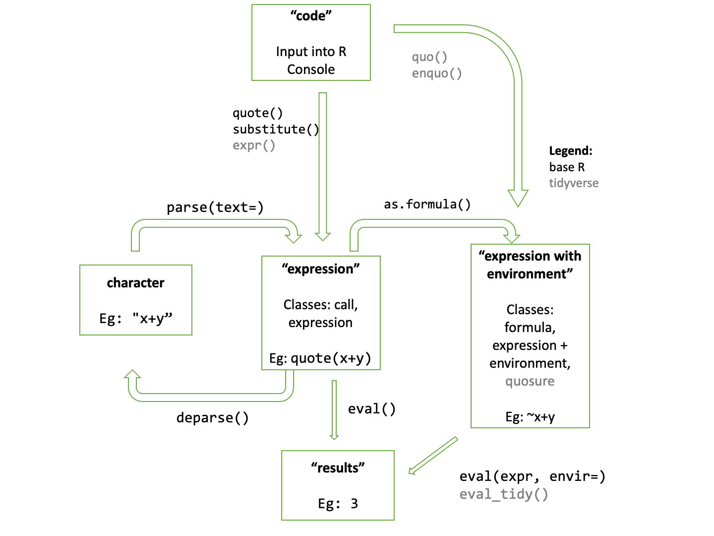

```{r xaringan-tile-view, echo=FALSE}
xaringanExtra::use_tile_view()
```

## Outline

- Overview 

- The base R system

- The tidyverse system

- Some applications

---

## References

- Chapters 17 -- 21, [Advanced R](https://adv-r.hadley.nz/index.html) by Hadley Wickham

- [rlang: Data masking and NSE](https://rlang.r-lib.org/reference/topic-data-mask.html)

---

class: big, middle

## Programming with the Language

---

## What do you mean?

- R code is an object
```{r}
e <- quote(x + y)
str(e)
```

- R code can be modified and evaluated
```{r}
x <- 0
e[[3]] <- 1
eval(e)
```

- This type of quote, modify, and evaluate pattern is very common in R, especially when non-standard evaluation (NSE) is used (recall NSE [here](08_lazy_evaluation.html#10))

---


## Why bother?

- `tidyverse`, `data.table`, and many other packages involve NSE

- We had better understand the behavior of NSE and `tidyverse` so we write more reliable code

- We would like to write functions relying on these packages, so need to learn ways to do this. The following naive implementation does not work:
```{r, error=TRUE, message=FALSE}
library(dplyr)
filterAtLeast5 <- function(col) {
    filter(sleep, col >= 5)
}
filterAtLeast5(extra)
```


---

Overview of language objects



---

## Some terminology

- We refer to objects returned by `quote()` as an expression, usually having the class `call`

- An "expression" in our words does *not* refer to an object in this sense: R has an `expression()` function that returns an `expression` object, which is just a list of `call`s. 

- An argument of a function follows *standard evaluation* (SE) if it is interpreted by the value

- An argument of a function follows *non-standard evaluation* (NSE) if it is evaluated according to the expression but not the value of the expression

- E.g., `dplyr::filter(.data, ...)` follows SE in its first argument but NSE in its `...` arguments
```{r, eval=FALSE}
filter(sleep, extra >= 5) # works
a <- extra >= 5; filter(sleep, a) # does not work
```

---


---

## Creating an expression

- `quote()` simply returns its argument verbatim but as an expression. This function is NSE in its argument

- An expression may have four types (classes)
    - a `call`, e.g., `quote(x+y)`
    - a `symbol`, e.g., `quote(x)`. `as.symbol()` creates a symbol from a string. Test with `is.symbol()`
    - a constant, e.g., `quote(1)`. Must be a scalar. E.g., `TRUE`, `1L`, `1.1`, `"x"`. Test with `rlang::is_syntactic_literal()`
    - a pairlist, e.g., `formals(seq.default)`. Very uncommon. Test with `is.pairlist()`

- An expression is operated like a list
```{r}
e <- quote(x + y + 1)
e[[1]] <- quote(`*`)
e
```

---

## Abstract syntax trees 

- Expressions are also called *abstract syntax trees (ASTs)* because it has a tree structure
```{r}
library(lobstr)
ast(x + y + 1) 
```

- It is "abstract" because spacing and comments from code are removed
```{r}
parse(text="x + 
y + 1 # comment")[[1]]
```

- `ast()` is NSE. If you have an expression and want to turn on SE behavior, use `ast(!!expr)` (a magic we will come back later)

---

class: inverse

## Your turn

- Create an expression containing `f(x, -y)` using `quote()`

- Use `ast()` to inspect the tree structure of the expression

- Modify the expression into `select(x, -y)` (Save the expression into a variable, and imagine it as a list. Now, operate on the expression components like what you do to list components)

---

## More ways to build an expression: Parsing

- Parsing a string (or text file) means converting it to expressions R can understand

- `parse(text=)` creates an `expression` object from text. `parse(file=)` parse a text file

    - However, this approach should be used sparingly especially if users input expressions to be evaluated. This can be dangerous because a malicious user could inject any code to break your function (or even your system)

---

## Substitute

- `substitute()` is an important way to build and manipulate expressions

- `substitute(expr, env)` is NSE in its first argument and SE in its second

- What it does is to return the parse tree in the 1st argument (like `quote()`), but also do the following
    - If it sees a symbol unbound in `env`, leave it unchanged
    - If it sees a symbol bound in `env`, replace it with the value unless `env` is the global environment
    - If it sees a promise, replace it by the expression value

---

Basic behavior:
```{r}
substitute(x + y)
substitute(x + y, list(x = 1))
substitute(x + y, list(`+` = quote(`*`)))
```
---

When it sees a promise:
```{r}
g <- function(x) substitute(x) 
g(x+y)
# default env is the current evaluation environment
g2 <- function(x) {
  a <- 1
  substitute(x + a)
}
g2(x + y)
```

---

## Eg 1

```{r, fig.height=5, fig.width=5}
# Taken from ?substitute
myplot <- function(x, y)
     plot(x, y, xlab = deparse(substitute(x)),
                ylab = deparse(substitute(y)))
x <- seq(-pi, pi, length.out=100)
myplot(cos(x), sin(x))
```

---

## Eg 2

Create a polynomial function $a_0 + a_1 * x^1 + a_2 * x^2 + ... + a_p * x^p$ from a vector aVec:

```{r}
aVec <- c(5, -2, 3)
exprList <- purrr::map(seq_along(aVec), function(j) {
    a <- aVec[j]
    power <- j - 1
    substitute(a * x ^ power)
})
a <- purrr::reduce(exprList, function(e1, e2) {
    force(e1)
    force(e2)
    substitute(e1 + e2)
})
a <- a
fExpr <- substitute(function(x) a, list(a=a))
f <- eval(fExpr)
print(f, useSource=FALSE)
```

---

## Eg 3

What if I have an expression already and want to modify it?

```{r}
# SE in its argument
plusToTimes <- function(expr) {
    do.call(substitute, list(expr, list(`+` = quote(`*`))))
}
e <- quote(1 + 2 + 3)
plusToTimes(e)
```

- `do.call(substitute, list(expr, ...))` enables SE behavior for the 1st argument of `substitute()`

---

## Evaluate code

- `eval(expr, envir)` evaluates expression `expr` in environment `envir`

- *Data masking*: If `df` is a data frame or a list, `eval(expr, envir=df, enclos)` will first look for variables in `df`, and then the remaining ones in environment `enclos`. Namely, the data frame masks the outer environment
```{r}
library(rlang)
val <- 1
eval(quote(ID == val), envir=sleep, enclos=rlang::current_env())
```

---

## The `subset()` (which has a problem)

The following is a re-implementation of `subset()` (taken from Adv-R). It is NSE in its 2nd argument and with a data mask:
```{r}
subset_base <- function(data, rows) {
  rows <- substitute(rows)
  rows_val <- eval(rows, data, caller_env())

  data[rows_val, , drop = FALSE]
}
my_df <- data.frame(x = 1:3, y = 3:1)
xval <- 1
subset_base(my_df, x == xval)
```
---

class: inverse

## Your turn

Add a third augument `col` to `subset_base()` in order select a single column using NSE. E.g., `subset_base(my_df, x == xval, y)` should return a data frame with a single `y` column

1. In the function, use `substitute(col)` to capture the expression user supplies in code

1. Turn that into a string (`deparse()`)

1. Slice the data frame using `[`

If you are unsure what is going on, use `browser()` to inspect the steps of the function

```{r, include=FALSE, eval=FALSE}
subset_base2 <- function(data, rows, col) {
  col <- substitute(col)
  col_val <- deparse1(col)

  rows <- substitute(rows)
  rows_val <- eval(rows, data, caller_env())

  data[rows_val, col_val, drop = FALSE]
}
subset_base2(my_df, x == xval, y)
```

---

## The problem

- `base::subset()` and `subset_base()` always evaluate rows in the calling environment, but if the condition is passed to this function, then the expression might need to be evaluated elsewhere:

```{r}
f1 <- function(df, ...) {
  xval <- 3
  subset_base(df, ...) # same for subset()
}

f1(my_df, x == xval)
```

- The problem lies in that the evaluation environment is not the environment where the condition is defined (recall [lazy evaluation](08_lazy_evaluation.html#5))

- This motivates defining an expression together with its environment

---

## Expression with an environment

- Under the hood, formula is an expression with an environment
```{r}
fm <- ~ x + y
str(fm)
```

- Use formula to solve the previous issue...

---

```{r}
# SE in the 2nd argument
subset_base2 <- function(data, rowsFm) {

  stopifnot(rlang::is_formula(rowsFm))
  rowsFm[[1]] <- quote(`(`) # remove `~`
  rows_val <- eval(rowsFm, data, environment(rowsFm))

  data[rows_val, , drop = FALSE]
}
f2 <- function(df, ...) {
  xval <- 3
  subset_base2(df, ...)
}

subset_base2(my_df, ~(x == xval))
f2(my_df, ~(x == xval))
```

---

class: big, middle

## The tidyverse and tidyeval

---


