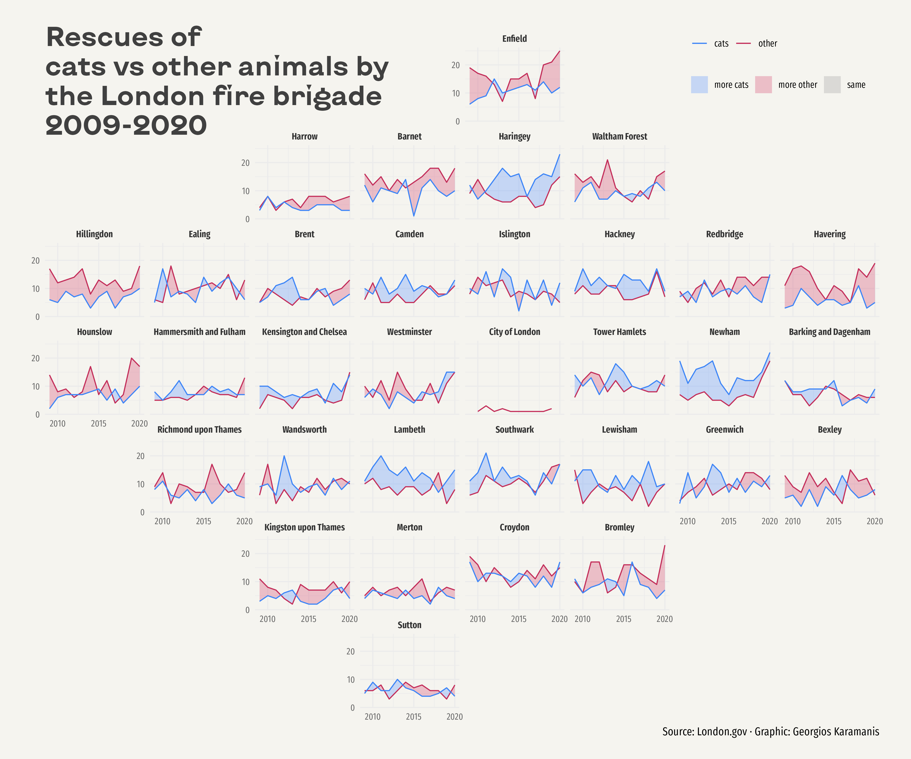
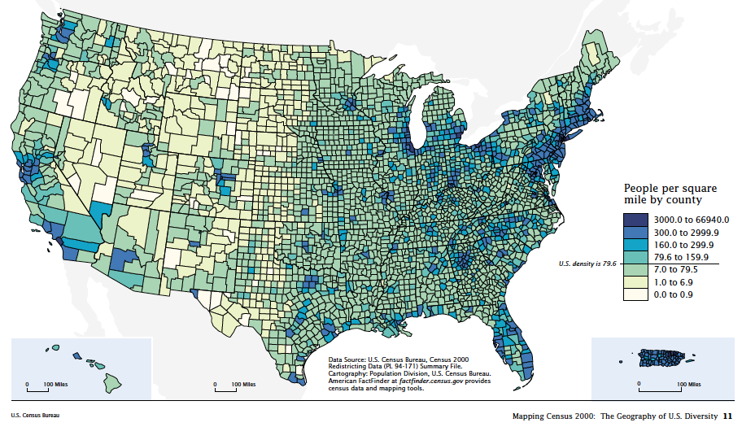
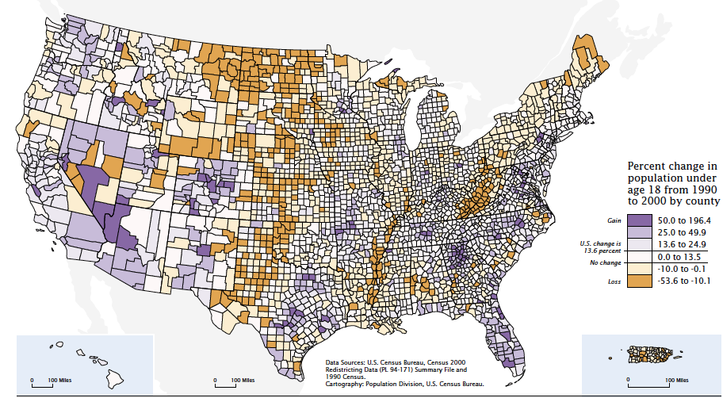
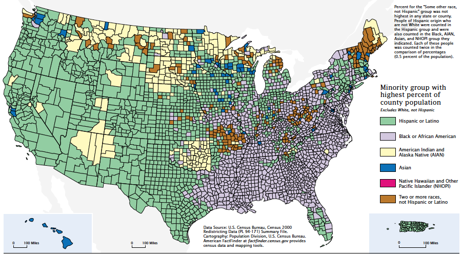

```{r xaringan-tile-view, echo=FALSE}
xaringanExtra::use_tile_view()
```

## Outline

- Visualization tools

- Some principles of graphics

---

## References

- Many examples are taken from the [excellent gallery](https://r-graph-gallery.com/index.html) made by Yan Holtz

- Plotly [documentation in R](https://plotly.com/r/)

- [Mastering Shiny](https://mastering-shiny.org/index.html) by Hadley Wickham

- [Shiny cheatsheet](https://www.rstudio.com/resources/cheatsheets/)


---

## Some basics

Here are some commonly used graphics file formats:

- Vector graphics: Use mathematical formula to describe the graph. Does not lose resolution when enlarged. Common file formats: svg, pdf, eps

- Raster graphics: Use pixels to describe the graph. Loses resolution when enlarged. Common formats: png, jpeg, gif, tiff

- Interactive graphics: Usually made with `D3`,  a javascript library for creating interactive graphics. Usually in html + svg 

---

class: middle, big

## What tools are available out there?

---

## What tools are available out there?


Interactive plot: 

- `plotly` is a cross-language tool for creating interactive graphics built upon `D3.js`

    - Easiest way to start is ggplot + `plotly::ggplotly()`. [Example](https://r-graph-gallery.com/interactive-charts.html)

    - You can also create layered graphics using just `plotly`. [See](https://plotly.com/r/)

Animation:

- `gganimate`, an R package to create animation using ggplot. [Example](https://r-graph-gallery.com/271-ggplot2-animated-gif-chart-with-gganimate.html)

- `ImageMagick`, a command line tool to stack static images into an animation

---

3D plot:

- `plotly`. Syntax is similar to its 2D versions

- `rgl`. An R package specialized in producing realistic 3D graphics. [Example](https://r-graph-gallery.com/3d.html#3dscatter)


All tools here involve generating the graphics *ahead of time*. The figures will be sent to reader's machine (just once)

---

class: inverse

## Your turn

- Create a ggplot figure and save it to a variable `p`. Use your favorite dataset and geom

- Turn the static figure into an interactive one using `plotly::ggplotly(p)`

---

## Web app tools

- [`shiny`](https://shiny.rstudio.com/) is an R package for creating a web app

- Here is [an example](https://shiny.rstudio.com/gallery/radiant.html) letting you to interactively explore a dataset
    
- [`dash`](https://dash.plotly.com/r/introduction) serves a similar purpose 

- These tools follow a server-client architecture, namely to generate and send over graphics *on the fly* by the server as the client requests

---

<!-- ## Server-client architecture -->


---

## Building a toy shiny app

- Ingredients:
    1. UI (user interface): The webpage layout the users are going to see
    1. server script: What code to be run in order to feed users the outputs they want

- Mindset when writing the server script: We are writing *functions* to tell how to make the output given an input

- An example is given below...

---

- We will show a scatter plot of life expectancy vs GDP. Each dot stands for a country. Data over the years are summarized by their means. 
- The user will specify how recent the data should be used.

```
library(shiny)
library(tidyverse)

ui <- fluidPage(
  sliderInput("yearThresh", 
              "Use data more recent than:", 1952, 2007, 1952),
  plotOutput("lifeGDPPlot")
)

server <- function(input, output, session) {
  output$lifeGDPPlot <- renderPlot({
    lifeGDP <- gapminder::gapminder %>%
      filter(year >= input$yearThresh) %>%
      group_by(country) %>%
      summarize(lifeExp = mean(lifeExp),
                gdpPercap = mean(gdpPercap))
    
    ggplot(lifeGDP(), aes(x = gdpPercap, y = lifeExp)) + 
      geom_point()
  })
}

shinyApp(ui, server)
```

---

class: inverse

## Your turn

Base your code upon the previous example. We will add another `plotly` interactive figure below the ggplot. Follow these steps:

1. For the UI, add an output using `plotlyOutput("lifeGDPPlotly")`

1. For the server, implement and output `output$lifeGDPPlotly`, but this time use `renderPlotly()` to render it. Make sure to create and return a plotly figure (`plotly::ggplotly()`)

---

## Reactivity

- Reactivity: Code within `renderXXX()` and `reactive()` functions will be run only if the output is requested. They are rerun only if the inputs are changed

- The order your code run is solely determined by the dependency of the reactivities

- Notes:
    - Input values can only be accessed within `renderXXX()` or `reactive()` functions
    - Output values can only be set within `renderXXX()` functions. They cannot be read

---

## How to choose a tool?

When we have a large dataset at hand and want to communicate a lot of information, we need to start to think about: 

- Where are the data? Where should the computation be performed?

- What do we need to communicate?

- How are users going to read the graphics?

---

class: middle, big

## Principles of Graphics

---

- One overarching principle: What is shown should be close to what readers perceive (faithfulness)
    - Ordering is important
    - Principle of proportional ink
    - Color schemes

- Many ways to go wrong

---
class: middle, big 

## Some good examples

---



A [step-by-step guide](https://r-graph-gallery.com/web-time-series-and-facetting.html) to recreate this figure

---

## [French invasion of Russia](https://en.wikipedia.org/wiki/Charles_Joseph_Minard#/media/File:Minard_Update.png)


By [Charles Joseph Minard](https://en.wikipedia.org/wiki/Charles_Joseph_Minard) (original), DkEgy (translator)

---

## Principle of proportional ink

The principle of proportional ink: If used to represent numerical values, the sizes of shaded areas, the width of a line, or the length of a line should be proportional to the data values they represent. (Edward  Tufte)

<div class="row">
  <div style="float: left;  width: 50%;">Bad: </div>
  <div style="float: left;  width: 50%;">Good: </div>
</div> 
(Wilke 2019, Fundamentals of Data Visualization)

---

## Lie factor (Tufte)

<center>  </center>

Bad: 
 

---

## Principle of Color Schemes

Using an appropriate color scheme to represent information is crucial. We follow the language of [ColorBrewer](http://colorbrewer2.org) (Cynthia Brewer)

---

## Sequential color scheme for representing *ordered* data 


---

## Diverging color scheme for *ordered* data with a meaningful center point


---

## Qualitative color scheme for *unordered* categorical data 


---

## Bad patterns

Here is a [gallery](https://www.data-to-viz.com/caveats.html) of common mistakes on a graph, made by Yan Holtz. E.g.,

- Too much overlap
- Unmeaningful ordering (e.g. for bar charts)
- Rainbow color on maps
