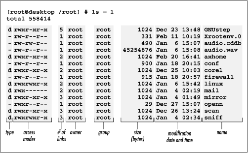

```{r xaringan-tile-view, echo=FALSE}
xaringanExtra::use_tile_view()
```

## Outline

- Navigating Linux file system

- Editing files

- Working with remote machines

---

## References

- Unix Power Tools, by Powers, Peek, O'Reilly, and Loukides

- Many manuals and tutorials available online

---

## Kernels and bash

.center[

</br>Source: [Computer Science wiki](https://computersciencewiki.org/images/0/0d/Os_family_tree.png)
]

- Bash is one of the most popular Unix shells. It is a text-based user interface (TUI) to the system services

- Bash allows us to note down all the commands in text and run them altogether, streamlining the workflow

- Bash is the standard way to operate a remote machine

---

## Linux mindset

- Everything is a file

- Programs are designed to work together

---

## Where to use bash

- If you finished the setup section in [HW3](../hwlabs/hw3.html#setting-up-tools-for-the-next-few-weeks), you can use bash in RStudio -- Terminal tab.

- If you are on MacOS, you can alternatively open the Terminal app

- If you are on Windows, you can alternatively open the WSL

- If you have not done the installations, use [dataHub](https://datahub.berkeley.edu/hub/home) -- new -- Terminal

---

## Navigating the file system

- `pwd`, show the (present) working directory

- `ls`, list files. It accepts flags such as `-a` (show all), `-l` (list format)

- `cd`, change directory

- `cp`, copy files. `cp -r` copies a directory

- `mv`, move/rename a file

- `rm`, remove files

---

## WSL users

- Your Windows files appear under `/mnt/` in WSL. It is fine to edit Windows files in WSL

- Your WSL files appear under `%LOCALAPPDATA%` in Windows. ***Never edit WSL files using Windows apps***

---

## Wild cards

- Wild card characters are used to specify file names that match a pattern

- `*` matches any string of characters (0 or more). E.g., `ls *.R`

- `?` matches any single character (0 or more). E.g., `ls analysis.?`

---

## Symbolic link

- A symbolic link is like a shortcut

- You can create a symbolic link to a file using `ln -s fileOrFolder putLinkHere`

---

class: inverse

## Your turn

- Go to your home directory (`cd ~`). If you are using WSL, go to somewhere under `/mnt/` that you are familiar with

- Make a new directory called bashDemo (`mkdir dirName`; change the directory name!)

- Move an R script into the directory into the new directory 

- Backup the directory (and its contents) using `cp -r dirName backupName`

---

## Text manipulation

- `cat fileName` prints the contents of a file

- `less fileName` shows the content in a browser 
    - `j/k` goes up/down. Arrow keys also work
    - `q` to quit
    - `h` to show help
    - `/somethingYouWantToSearch<CR>` to perform search. `<CR>` means the enter key
        - `n/p` for the next/previous result

- `diff file1 file2` shows what is changed

---

## Vim

- Vim is a highly powerful command-line editor. There are many other editors native to Unix like `Emacs` and `nano`

- `vi filename` to edit a file

- Vim is a modal editor. Namely, it has a normal (browsing) mode, insertion mode, etc

- This design enables a great amount of shortcuts and thus quick modification

- `vim` operations:
    - `j/k/h/l` goes up/down/left/right. Arrow keys also work
    - `i` to enter insertion mode. `<Esc>` to exit from insertion mode
    - To save a file, in the normal mode, type `:w<CR>`. To exit, `:q<CR>`
    - Search works as in `less`

- Here is a [cheatsheet](http://www.viemu.com/vi-vim-cheat-sheet.gif) which lists commonly used Vim operations

---

class: inverse

## Your turn

- Use `vim` to add a line to the R script in your newly created folder

- Save the file and quit `vim`

- Compare the content of your new edit and the backup version in another folder using `diff`

---

## Getting information on Unix

Getting help:

- Most commands support `--help` or `-h` flags for a quick startup tip
- `man cmdName` shows the full menu page in a `less` browser

Getting info:
- `whoami` shows your user name
- `hostname` shows the hostname, i.e., the machine name on a network
- `which cmdname` shows the location of a command
- `uname -a` shows the kernel

For Linux:
- `cat /proc/cpuinfo` shows cpu info
- `cat /proc/meminfo` shows memory info
- `lsb_release -a` shows the distro (e.g., Ubuntu)

---

## Scripting in bash

- Variables in bash are defined using `A=someValue`. There should be *no space* around `=`

- `$A` gets the value of `A`. `echo $A` prints that out

- To make an executable bash script, create a new file `vim myScript` and include `#!/bin/bash` on the first line. The rest of the lines should include bash commands. E.g., 

```
Biostat-MBP14-04:PH290$ cat myscript
#!/bin/bash
mkdir tmp
touch tmp/file
```

---

## dotfiles

- File and folders with names starting with `.` are hidden

- E.g., in your home directory
    - `.bash_profile` include bash commands that will be run every time you log into bash
    - `.Rprofile` include R commands that will be run before R starts up (For MacOS and Linux only)

---

## Permissions

- `ls -l` shows the permissions and ownerships 

</br>O'Reilly Open Books (CC)

---

- Permission: Who can do what to this file?
.center[
 
</br>Linuxcommands.org
]

---

## Input/output on Unix

- Unix has one input channel *stdin* (standard input, like your keyboard input) and two output channels, *stdout* (standard output) and *stderr* (standard error)

- Redirection 
    
    - `ls >file` redirects the output of `ls` to `file`

    - `cat <file` redirects the content of `file` as input for `cat`

    - `Rscript -e "print('prt'); message('msg'); stop('error')" 1>out 2>err` redirects stdout to `out` and stderr to `err`

    - `Rscript -e "print('prt'); message('msg'); stop('error')" >file 2>&1` combines stdout and stderr and redirect to `file`

---

## Pipes

- Commands on linux are meant to work with each other

- `|` is the pipe operator in linux (like `%>%` in tidyverse)

- `ls | wc` passes the output of `ls` as the input of `wc` (for word count)

- `ls -l | grep analysis` shows only lines including "analysis" in the `ls -l` output

---

## Job management

- `top` shows the dynamic status of the processes that are running (by everyone)

- `ps` shows a static snapshow of the processes and the process ID

- `kill PID` terminates a process. `kill -KILL PID` kills an unresponsive process

- When you are interacting with a process, `<C-C>` interupt the process (eg, stop a long calculation in R)

---

To work with multiple processes

- `<C-Z>` sends a process you are interacting with to the background. The process is stopped by default

- `jobs` show all the jobs in the background. `Jobs` are processes spawned in the current bash session

- `bg jobID` makes a stopped job in the background continue to run

- `fg jobID` brings a background job to the foreground

---

## Working on a remote machine

- `ssh destination` will remote login a machine. The destination specification often looks like `username@hpc.brc.berkeley.edu`

- Authentication is needed before you can connect. So if you want to connect to a remote machine, look at its help webpage and see how to set up an account

- `scp source:path/on/source destination:path/on/destination` copies a file from a source machine to a destination machine. This lets you copy from any local/remote machine to any other machine. If you prefer a GUI, try WinSCP on Windows or Cyberduck on mac

---

- When you are working on a remote machine (like savio later), your jobs will usually be killed after you log out

- `tmux` is a program to let you run multiple windows within the same bash session. It also prevents your jobs in there from being kill when you log out or get disconnected
    - It is usually installed on remote machines by default. But on a local machine you need to install yourself
    - `tmux` creates a new session
    - Within a session
        - `<C-B>c` creates a new window
        - `<C-B>n` goes to the next window
        - `<C-B>p` goes to the previous window
        - `<C-B>d` detaches the tmux session. You can safely log out bash
    - Next time you log in, `tmux attach` reattach to the last session 

