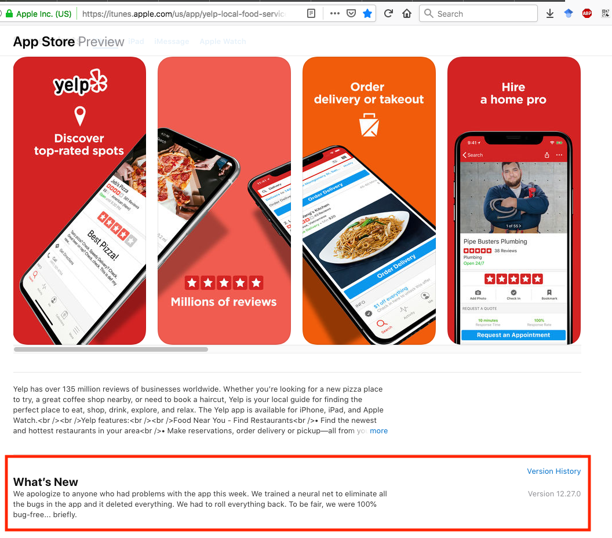
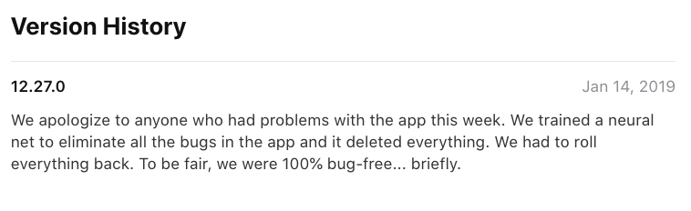

```{r xaringan-tile-view, echo=FALSE}
xaringanExtra::use_tile_view()
```

## Outline

- The Git model

- Basic Git workflow

- Branching

- Git on a server

---

## References

- [Pro Git](https://git-scm.com/book/en/v2)

- [Git flow, a git branching workflow](https://nvie.com/posts/a-successful-git-branching-model/)

---


## Mess in the code

<center>

</center>

---

## Mess in the code
**Yelp's application update:**

<center>

</center>

---

class: big, middle

## The Git model

---

## What is Git?

- *version control system* that is created to track changes in source codes and manage collaborative projects. 
`git` tracks the evolution of a folder containing code files and subfolders

- Git is one of the most popular version control systems

- Git helps us
    - *make records* of the code files, creating snapshots
    - *compare* snapshots to locate changes or bugs
    - *rollback* to a previous version of a file/entire project
    - store *master* and multiple versions of files, no more `paper_final_final_I_really_mean_it.docx`
    - *merge* versions and *resolve conflicts* that arise from collaboration

- Git works well with text files but not binary files

---

## Git 

Some terminologies ([more here](https://help.github.com/articles/github-glossary/)):

- **Repository/repo:** the basic element of `git` - like a project's folder. A repository contains all of the project files, and their __revision history__
- **Commit:** A checkpoint, i.e., snapshot of the codes files at a time point. Every commit has a unique commit ID. Every commit has at least one parent (the previous snapshot it's based on), except for the initial commit which has no parents

.center[

</br>Source: [Pro Git](https://git-scm.com/book/en/v2)
]

---

## Git mindsets

- When passing repos between machines, Git always mirrors the entire repository, including the full history

- Think about Git commits as snapshots, not differences

- Nearly every operation is local

---

## File stages

- A file can assume four *states* in a Git repo:

    - Untracked means Git ignores the file when making snapshots
    - Unmodified/Committed means that the data is safely stored in your local database and no newer modification exists
    - Modified means that you have changed the file but have not committed it to your database yet
    - Staged means that you have marked a modified file in its current version to go into your next commit snapshot

.center[

]

---

class: big, middle

## Basic Git workflow

---

## Basic Git workflow

The basic Git workflow goes like this:

1. You modify files in your working directory
2. You selectively stage just those changes you want to be part of your next commit, addiing (only) those changes to the staging area
3. Commit, which stores the files in the staging area into a new and permanent commit (snapshot) in your Git directory

---

## Using `git` from the command line

- We will be using `git` from the bash command line

- Type `git --version` in bash to check you have git installed

- Configure `git` using 
```
git config --global user.name "your first and last name"
git config --global user.email "your email"
```

---

## Two ways to get started

There are two ways to make/obtain a Git repo

- Initiate a repo in a directory: In a *non-git* repository, issue `git init`. Caution: Do not nest a git repo within another

- Clone an existing repo from elsewhere: In a *non-git* repository, issue `git clone someURLCopiedFromGitHub`

---

## `git` Demonstration...

---

## Git commands

Here is a list of important git commands:

- `git init` initialize a git repo
- `git add` add files to the staging area
- `git commit` flushes files in the staging area to a new commit
- `git status` report the status of the repo
- `git log` shows the commit history of the repo
- `git diff` shows the difference in the modified files. `git diff c1 c2` shows the difference between two commits 

---

class: inverse

## Your turn

1.  Create a new folder for a git repository (`mkdir`) and change directory into that (`cd`)
2.  Initiate the current directory as a Git repository (`git init`). What does `git status` show? 
3.  Move an R script into this directory (`mv`, or use your file browser). Add the file to the staging area (`git add fileName`). Create a commit (`git commit`)
4.  Modify the R script (using either `vi` or open it with a GUI text editor in your OS). Add the file and commit.
5.  Look at the repo status (`git status`) and repo history (`git log`)
6.  Look at the difference between the two commits (`git diff CID1 CID2`)

---

class: big, middle

## Working with branches

---

## Branches in Git

- A branch in Git is a reference/pointer to a commit

- HEAD is a pointer to the branch you are currently working on

.center[

]

- Branches are cheap to make. So branch often and branch early

---

## Working with branches

- `git branch newBranchName` creates a new branch

- `git checkout branchName` checks out a branch. If you make new commits, they will be found in this branch

- `git checkout commitID` checks out a commit for inspection

---

## Merging branches

- Different branches contains different snapshots

- We can *merge* changes made in two branches into a combined version

- `git merge` let us merge branches

---

Suppose you are on the `main` branch and want to merge in `branch1`. There are two scenarios that can happen when you run 

```
git merge branch1
```

- *Fast forward* is the simplest situation. This happens if `branch1` contains all changes made in `main`. Then, `main` will point to the same commit as `branch1`

- If the histories of two branches diverge, then a *three-way merge* is performed

---

## Merge conflicts

- If the two histories conflicts, you must manually resolve them

- Open a file in conflict using a text editor and update the file

- Edit the conflicted parts
```
I have:
<<<<<<<
a mouse
|||||||
a dog
=======
a cat
>>>>>>>
```
    into a version that you want to keep

    ```
    I have:
    a pet
    ```
---

class: inverse

## Your turn

1. Create a new branch (`git branch branchNameHere`)

1. Check out to that branch (`git checkout branchNameHere`)

1. Make sure you are on the right branch (`git log` or `git status`)

1. Create a new file, and make a commit

1. Checkout out the `main` branch

1. Merge your branch into `main` (`git merge branchNameHere`)


---

class: big, middle

## Git on a server

---

## Git on a server

- [GitHub](github.com) is one of many hosting services, which provides additional project management functions 

- When `Git` send/receive info from the server, it copies the entire repo

<center>

</center>

---

## More `git` commands for servers

- `git remote`: Set up a remote to be used for a local repo
- `git push`: Push updates in the local repo to the remote
- `git pull`: Obtain updates from the remote and apply them to the local repo
- `git fetch`: Obtain updates from the remote without applying them to the local repo
- `git clone`: Clone a remote repo to the local machine. Use only once when you do not have a local copy

---

## Authentication

When you push to a GitHub repo, you will need to authenticate. 

If you use a HTTPS url (easier):
- For security reasons, password does not work anymore
- You will need to create a temporary password
- Follow the guide in [creating a personal access token](https://docs.github.com/en/github/authenticating-to-github/keeping-your-account-and-data-secure/creating-a-personal-access-token) 

If you use a SSH url:
- Need to set up [SSH key authentication](https://docs.github.com/en/authentication/connecting-to-github-with-ssh/adding-a-new-ssh-key-to-your-github-account)

