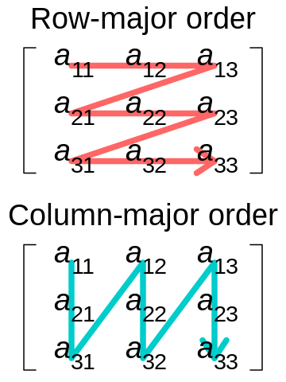

```{r xaringan-tile-view, echo=FALSE}
xaringanExtra::use_tile_view()
knitr::opts_chunk$set(
  cache=TRUE, fig.width = 6, fig.height = 6
)
```

## Outline

- Benchmarking and profiling

- Common ways to speed code up

- Memory considerations


---

## References

- [Chapter 2, 23, 24, Advanced R](https://adv-r.hadley.nz/)

---

## When to optimize code

The priority of code is:

1. Correct
1. Clear
1. Stable
1. Finally, optimize speed and space

- Make sure the code is mature enough that warranties optimization

- Before making code faster, we must figure out what part makes it slow

- Focus on optimizing the bottlenecks but not unimportant components

- Aim for code that is fast enough

---

class: big, middle

## Benchmarking and profiling

---

## Benchmarking

Benchmarking is the process of measuring how much time does a snippet of code runs.

- `system.time()` is a build-in timer
    ```{r}
    system.time(lm(price ~ ., data = ggplot2::diamonds))
    ```

    - `user` is the CPU time spent by the current process (R)
    - `system` is the time spent by the operating system (e.g., for opening files)
    - `elapsed` is the clock time used, which is usually the time we care about

- Discard the timing for the first run of your code, since it often contains one-time overheads (e.g., loading libraries/data)

- Repeat quick running code for an enough number of times so the total time reveals a meaningful difference


---

## `library(bench)`

- `library(bench)` is a library for performing high-precision benchmarking

- It repeats the expression adaptively for a reasonable total amount of time

- Tracks not just run time but also memory allocation
    ```{r}
    library(bench)
    n <- 1e3
    x <- rnorm(n)
    bench::mark(mean(x))
    ```
---

- `bench::mark()` checks whether the results are the same by default:
```{r}
bench::mark(e1=var(x), 
            e2=n / (n - 1) * (mean(x^2) - mean(x)^2), 
            check=TRUE)
```

- `bench::press()` runs benchmarks against a grid of parameters, and `ggplot2::autoplot()` visualizes the pressed results
```{r, eval=FALSE}
res <- press(n = 10^(2:4), {
        x <- rnorm(n)
        bench::mark(var(x), n / (n - 1) * (mean(x^2) - mean(x)^2))
ggplot2::autoplot(res)
})
```

- Lower quantiles of the timing results are more meaningful than the upper quantiles, since the performance can occasionally be affected by other tasks running on the same system (e.g. indexing files)

---

## Profiling

- Benchmarking is for measuring the *total* run time of usually short expressions

- Profiling is the process of examining how much time does *each component* of a complex expression/function take

- Profiling is used to understand performance and itentify bottlenecks for potential optimization

---

## Base R profiler

- `Rprof()` is a sampling profiler provided by R, which records the results in a text file. `summaryRprof()` summarizes the results
```{r}
Rprof()
for (i in 1:10) lm(price ~ ., data = ggplot2::diamonds)
Rprof(NULL)
summaryRprof()
```

---

- When running a complex expression, a profiler works by pausing every few miliseconds and recording what function is currently being called. Functions recorded more often this way takes more time

- `Rprof(memory.profiling = TRUE)` offers memory profiling

---

## `library(profvis)`

`library(profvis)` provides a convenient interface to visualize the profiling results.

```{r}
profvis::profvis(
    for (i in 1:10) lm(price ~ ., data = ggplot2::diamonds),
    simplify=FALSE
)
```

- `simplify=FALSE` shows more information including the run time of the lazy evaluation frames


---

class: inverse

## Your turn

- Use `bench::mark()` to compare the formula and the vector interfaces of `t.test`. Set `check=FALSE` since the results slightly differ in format
    - `t.test(extra ~ group, sleep)`, and 
    - `t.test(sleep$extra[sleep$group == 1], sleep$extra[sleep$group == 2])`

- Inspect what is the slowest step in the following
```
profvis::profvis({
for (i in 1:10) {
    m <- lm(price ~ ., data = ggplot2::diamonds)
    summary(m)
}
}, simplify = FALSE)
```

---

class: big, middle

## Common ways to speed code up

---

## Do less

- `lm`, `lm.fit`, `.lm.fit` perform decreasing amount of computation

```{r}
X <- matrix(rnorm(200 * 2), 200, 2)
y <- rnorm(200)

mark(lm(y~X), 
     lm.fit(X,y), 
     .lm.fit(X,y), 
     check=FALSE)
```

- Read the documentation for tips to speed up

---

## Use a more efficient algorithm

- For most of common analytical tasks, there are existing efficient implementations so you won't need to reinvent the wheel

- If you need to select tools for implementing a time-consuming computation, benchmark them

- Numerical linear algebra often take up significant amount of time. Different implementations could have quite different performance
```{r}
bench::mark(
    t(X) %*% X,
    crossprod(X)
)
```

- There are multi-thread numerical linear algebra libraries that can make use of multiple cores simultaneously. E.g., [Intel MKL](https://www.intel.com/content/www/us/en/develop/documentation/get-started-with-mkl-for-dpcpp/top.html)

---

- Matrix-matrix multiplication is more expensive than matrix-vector multiplication
```{r}
bench::mark(
    solve(t(X) %*% X) %*% t(X) %*% y, 
    solve(t(X) %*% X) %*% (t(X) %*% y), 
    check=FALSE)
```
... but both are much slower than `lm.fit` applies QR-decomposition

- If you have a lot of regressions with the same predictors but a difference response, you can precalculate `solve(t(X) %*% X) %*% t(X)` and reuse them for different response

---

## Cache results

- Caching means saving results. Given the same input, the results will be loaded the next time but not calculated

- `library(memoise)` saves results in the memory; it can save to the hard disk as well

- Good for handling user-specified inputs with many possibilities

---

```{r, message=FALSE}
library(dplyr)
library(memoise)
f <- function(col) {
  nycflights13::flights %>%
    group_by(year, month, day, !!as.symbol(col)) %>%
    summarize(mean=mean(arr_delay, na.rm=TRUE))
}
mf <- memoise(f)
system.time(mf("carrier"))
system.time(mf("carrier"))
```

---

## Vectorize operations

- R is an interpreted language, so is slower than compiled languages 

- R functions call fast C/C++/Fortran functions under the hood. Most base R functions accept vectors/matrices as input (`sqrt()`, `rnorm()`, `rowMeans()`, etc)

- Vectorized code is much faster than loops and the apply/map functions

- Vectorized code is usually much clearer, so should be preferred

---

- E.g., we would like to find the sum of $f(x, y) = \text{sin}(x y^2)$ over a grid of values $x,y \in \{0.001, 0.002, \dots, 0.999, 1\}$

```{r}
vals <- seq(0, 1, by=0.01)
mark(forloop={
  sum <- 0
  for (x in vals) {
    for (y in vals) {
      sum <- sum + sin(x * y^2)
    }
  }
  sum
}, vectorized={
  len <- length(vals)
  X <- matrix(vals, len, len)
  Y <- t(X)
  sum(sin(X * Y^2))
}
)

```


---

## Case study: Susceptible, Infected, and Recovered (SIR) model

The SIR model is widely used for modeling people infected with a contagious disease. $S$, $I$, and $R$ are the proportions of susceptible, infected, and recovered people at a given time, respectively. Over time, the three processes the following relationship

$$ dS/dt = -\beta S I$$
$$ dI/dt = \beta S I - \gamma I$$
$$ dR/dt = \gamma I$$

where $\beta$ is the infection rate and $\gamma$ is the recovery rate. We would like to simulate the SIR model

---

```{r}
SIR_orig <- function(duration, dt, beta, gamma, initial) {
  res <- matrix(initial, nrow=1) # contains (S, I, R)
  len <- floor(duration / dt) + 1
  for (i in seq(2, len)) {
    # dS = -beta * S * I dt
    S <- res[i - 1, 1] - beta * res[i - 1, 1] * res[i - 1, 2] * dt

    # dI = (beta * S * I - gamma * I) dt
    I <- res[i - 1, 2] + (beta * res[i - 1, 1] * res[i - 1, 2] - 
                                  gamma * res[i - 1, 2]) * dt

    # dR = gamma * I * dt
    R <- res[i - 1, 3] + gamma * res[i - 1, 2] * dt

    res <- rbind(res, c(S, I, R))
  }
  list(SIR=res, T=seq(0, duration, by=dt))
}
```

---

```{r}
beta <- 1/2
gamma <- 1/3
duration <- 100
dt <- 0.005
initial <- c(0.999, 0.001, 0)
s <- SIR_orig(duration, dt, beta, gamma, initial)
matplot(s$T, s$SIR, type='l')
```

- Pretty slow for a reasonably simple task. Why?
- Use profiling to investigate

---

## Don't grow an object

- `profvis::profvis(SIR_orig(duration, dt, beta, gamma, initial))` shows that almost all time are spent in `rbind()`

- It is allocating and releasing a lot of memory repeatedly

---

- So pre-allocate memory instead
```{r}
SIR_prealloc <- function(duration, dt, beta, gamma, initial=c(0.999, 0.001, 0)) {
  len <- floor(duration / dt) + 1
  res <- matrix(0, len, 3)
  res[1, ] <- initial
  for (i in seq(2, len)) {
    res[i, 1] <- res[i - 1, 1] - beta * res[i - 1, 1] * res[i - 1, 2] * dt
    res[i, 2] <- res[i - 1, 2] + (beta * res[i - 1, 1] * res[i - 1, 2] - 
                                  gamma * res[i - 1, 2]) * dt
    res[i, 3] <- res[i - 1, 3] + gamma * res[i - 1, 2] * dt
  }
  list(SIR=res, T=seq(0, duration, by=dt))
}
```

```{r}
bench::mark(
  SIR_orig(duration, dt, beta, gamma, initial), 
  SIR_prealloc(duration, dt, beta, gamma, initial), 
  )
```

---

## Save intermediate objects
 
```{r}
SIR_saveIntermediate <- function(duration, dt, beta, gamma, initial=c(0.999, 0.001, 0)) {
  len <- floor(duration / dt) + 1
  res <- matrix(0, len, 3)
  res[1, ] <- initial
  for (i in seq(2, len)) {
    a <- beta * res[i - 1, 1] * res[i - 1, 2] * dt
    b <- gamma * res[i - 1, 2] * dt
    res[i, 1] <- res[i - 1, 1] - a
    res[i, 2] <- res[i - 1, 2] + a - b
    res[i, 3] <- res[i - 1, 3] + b
  }
  list(SIR=res, T=seq(0, duration, by=dt))
}
```

```{r}
bench::mark(
  SIR_prealloc(duration, dt, beta, gamma, initial), 
  SIR_saveIntermediate(duration, dt, beta, gamma, initial), 
)
```

---
class: big, middle

## Memory considerations

---

## Avoid copying objects

- R impliments a copy-on-modified mechanism

- `tracemem()` traces when an object is copied
```{r}
x <- seq(0, 1, length.out=100)
tracemem(x)
y <- x
y[1] <- 1
```

---


- `x[1] <- x[1] + 1` usually modifies `x` in-place, but if you pass `x` into a function, it is copied if modified
```{r}
x[2] <- 2 # no copy
f <- function(z) {
  z[1] <- 10
  invisible(z)
}
f(x) # copy
```

- Could use an environment to avoid copies 

---

## Rows and columns are not symmetric

- Summing over the rows vs summing over the columns could have quite different performance
```{r}
n <- 1e4
p <- 1e4
X <- matrix(rnorm(n * p), n, p)
tX <- t(X)
mark(apply(X, 2, sum),
     apply(tX, 1, sum))
```

---

- This is because a matrix is stored like a linear vector in the memory, following one of these layouts:
.center[

]

- R is column major, so data within the same column are stored closer together in the memory

---

## Cache misses

- Data need to be loaded into CPU caches from the memory for computation

.center[

]

- To save time, data needed and their neighbors on the memory are loaded in consecutive chunks into the caches

- If the data does not exist in a CPU cache, it must be loaded again, which is time-consuming. This is called a cache miss

- So in R, working with data within a column is faster than that within a row. This minimizes cache miss

---

## Running out of memory

- 1 byte = 8 bits = 256 potential values

- An R numeric value takes 8 bytes, and an integer has 4 bytes

- So 1 million = $10^6$ numeric values takes 8Mb
```{r}
z <- rnorm(1e6)
lobstr::obj_size(z)
```

- Usually, memory issues start to appear when you have $>10^8$ observations

- If memory is not large enough to perform the computation, software will utilize the *swap file*, a file on the hard disk. Namely, transfer contents back and forth from the memory and the hard disk until computation is finished

---

## Solutions for running out of memory

From less to more amount of work:

- Subsample your dataset and run with fewer observations

- Use a machine with a larger memory

- Use a package for making use of the harddisk for computation
    - `library(biglm)`
    - `library(bigmemory)`

- Use a smarter algorithm. E.g., 
    - linear regression can be performed by reading in and aggregating data chunk-by-chunk
    - For bootstrapping a large dataset, consider using [bags of little bootstrap](https://arxiv.org/abs/1112.5016)
