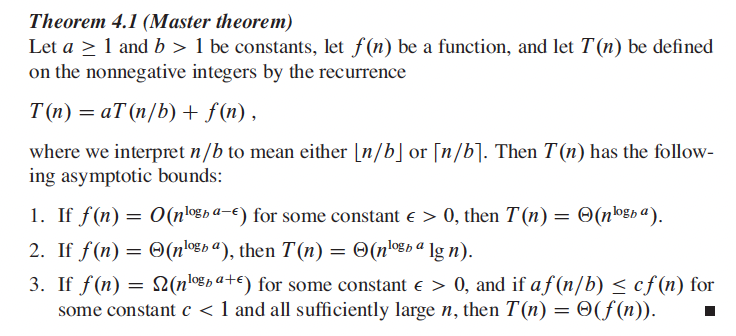

```{r xaringan-tile-view, echo=FALSE}
xaringanExtra::use_tile_view()
knitr::opts_chunk$set(
  cache=TRUE, fig.width = 6, fig.height = 6
)
```

## Outline

- Show correctness

- Computation complexity

- The divide-and-conquer approach

- Classical algorithms and data structure
    - Binary search
    - Quicksort
    - Hash table

<!-- - Matrix algorithms -->

---

## References

- [Introduction to Algorithms 3rd Edition](https://cran.r-project.org/doc/manuals/R-exts.html) by Cormen, Leiserson, Rivest, and Stein (CLRS)

---

## Algorithms

- Informally, an *algorithm* is a computational procedure (series of computational steps) that takes a set of values as input and produces a set of values as output

- An *"efficient"* algorithm is a smart one that is either "fast" or "save memory"

- Space-time tradeoff: An algorithm trades increased space usage with decreased time

    - E.g., if you cache results, then space $\uparrow$ but time $\downarrow$
    - Will see again in hash tables

- Algorithms operates upon *data structures*, which are ways to organize data in the computer memory/harddisk. E.g.,

    - Array
    - Linked list
    - Hash table

---

## Insertion sort

- Input: An array `A` of numbers
- Output: Sorted version of `A`
- Algorithm: The insertion sort. Work from the left to the right, and insert the number into the right location on the left

Pseudocode: Suppose `length(A) = n`.

```{r, eval=FALSE}
INSERTION-SORT(A)
for j = 2:n
    key = A[j] # current card
    # Insert A[j] into the sorted sequence A[1:(j-1)]
    i = j - 1
    while (i > 0 and A[i] > key)
        A[i + 1] = A[i]
        i = i - 1
    A[i + 1] = key
```

---

## Correctness

Prove that this algorithm is correct through mathematical induction:
- (*Initialization*) In the first iteration, you pick `A[2]`, and the cards on the left (just `A[1]`) are sorted

- (*Maintenance*) 
    - (*Loop invariance*) As the algorithm progresses, before each card `A[j]` is inserted, the first `j-1` cards (on the left to it) are sorted 
    - After you insert card `A[j]`, the first `j` cards (on the left to the next card `A[j+1]`) are sorted 

- (*Termination*) The algorithm terminates when you are done with the `n`th card. So all `n` cards are sorted

---

## Measuring efficiency

- We would need a theoretical model to measure the efficiency of algorithms, should they be invoked on inputs with a large size 

- The amount of time/space taken by an algorithm is determined by the *input size*, e.g., the array size $n$

- Assume we have a one-processor, *random-access machine (RAM)* model

- The following primitive operations take constant amounts of time
    - read/write a single number into a given address in the memory (e.g., write an array entry)
    - add, subtract, multiply, divide, remainder, floor, ceiling
    - raising powers, exponential, logarithm, basic math functions
    - control flows (if/else branches, function calls, return)

- The run time for these operations are comparable. They are assumed to be the same for simplicity

- The *cost in time* of the algorithm is measured by the number of primitive operations executed

---

## Worst-, average-, and best-case analysis

The run-time for a particular instance depends on the exact input. To simplify analysis, consider

- *Average-case* time complexity is the cost in time averaged over the distribution of user inputs. This is what we care about in practice

- *Worst-case* time complexity gives an upper bound on the running time for any input. It gives the time cost under an adversarial input

- *Best-case* analysis is seldomly useful

---

## Order of growth

- The *order* of growth in time as $n$ increases is the most important measure for time

Asymptotic notations:

- An algorithm takes $\Theta(g(n))$ time if its run time $T(n)$ scales like $g(n)$ (i.e., $c_1 g(n) \le T(n) \le c_2 g(n)$ for some $0<c_1<c_2<\infty$ for large enough $n$). E.g., the average time complexity of insertion sort is $\Theta(n^2)$

- An algorithm takes $O(g(n))$ time if its run time is at most a constant multiply of $g(n)$ (between $c_1 g(n)$ and $c_2 g(n)$ for some $0<c_1<c_2<\infty$). The average time complexity of insertion sort is $O(n^2)$

- Worst-case and average-case analyses may have different time complexities

- Insertion sort: Worst $\Theta(n^2)$, average $\Theta(n^2)$, best $\Theta(n)$

---

class: big, middle

## The divide-and-conquer approach

---

## The divide-and-conquer approach

- Many problems can be solved via solving smaller subproblems, the latter of which are much easier to solve

- This type of problems can benefit from a divide-and-conquer approach

- The subproblems are often similar to the main problem in nature, so if you have an algorithm to solve the subproblem, you can use that to build a solution for the main problem. If your algorithm utilizes itself to solve subproblems, it is called *recursive*

---

- E.g., the following is a recursive algorithm to find the nth Fibonacci number. The first few values of the Fibonacci numbers are: $F_0=0$, $F_1=1$, $F_2=1$, $F_3=2$, $F_4=3$, $F_5=5$, ... The $n$th number is the sum of the two numbers preceeding it
    ```{r}
    fib <- function(n) {
        if (n >= 2) {
            fib(n - 1) + fib(n - 2)
        } else if (n == 1) {
            1
        } else if (n == 0) {
            0
        }
    }
    ```

---

## E.g., binary search

- Input: A value `v` and an array `A` of numbers. We require that `A` is *sorted* in an increasing order

- Output: The first index `i` such that `v=A[i]`, or `-Inf` if `v` does not exist in `A`

- Algorithm: The binary search. Idea: Cut the array into two halfs. You only need to search in one half because the numbers are ordered

---

```{r, eval=FALSE}
BINARY-SEARCH(A, v)
    cand = floor(length(A) / 2)
    if (A[cand] >= v) {
        i = BINARY-SEARCH(A[1:cand], v)
    } else {
        i = BINARY-SEARCH(A[(cand+1):length(A)], v)
    } ## WRONG! does not terminate if v is not found
```

---

Pseudocode:
```{r, eval=FALSE}
BINARY-SEARCH(A, v)
    cand = floor(length(A) / 2)
    if (length(A) == 1) {
        if (A == v) {
            return(indexOf(v))
        } else {
            return(-Inf)
        }
    } else if (A[cand] > v) {
        i = BINARY-SEARCH(A[1:cand], v)
    } else {
        i = BINARY-SEARCH(A[(cand+1):length(A)], v)
    }
```

---

## Correctness

- The subarray we search is the first subarray that may contain value `v`

- Every time we create a partition, we will then search in the first subarray that may contain `v`

- The algorithm terminates if there is only one element in a subarray. It either finds the first index i so that `A[i]=v`,  or if `v` does not exist in `A`, a negative number

---

## Time complexity analysis

- Let $T(n)$ be the worst-case time cost required for BINARY-SEARCH to search an array with length $n$

- Then $T(n) = T(n / 2) + c_0$, and $T(1) = c_1$ where $c_0, c_1$ are positive constants (like 5)
    - $T(1) = c_1$, 
    - $T(2) = c_1 + c_0$, 
    - $T(4) = c_1 + 2c_0$, 
    - $T(8) = c_1+ 3c_0$, 
    - $T(16) = c_1 + 4 c_0$, ...

- Turns out $T(n) = \Theta(\log(n))$ for binary search

- Proof method: Make a guess, and show by mathematical induction

---

## Analytic derivation

From the book of CLRS:
.center[

]

---

## Code implementation

R implementation (does not have time scaled as intended. Why?)

```{r}
binarySearch <- function(A, v) {
    cand = floor(length(A) / 2)
    if (length(A) == 1) {
        if (A == v) {
            return(1L)
        } else {
            return(-Inf)
        }
    } else if (A[cand] >= v) {
        binarySearch(A[1:cand], v)
    } else {
        binarySearch(A[(cand+1):length(A)], v) + cand
    }
}
```

---

C++ implementation `binarySearch.cpp`:
```
#include <cmath>
#include <Rcpp.h>
using namespace Rcpp;

int bs (double* A, int n, double v) {
    int cand = n / 2;
    if (n == 1) {
        if (A[0] == v) {
            return(0);
        } else {
            return(-n);
        }
    } else if (A[cand - 1] >= v) {
        return(bs(A, cand, v));
    } else {
        return(bs(A + cand, n - cand, v) + cand);
    }
}

// [[Rcpp::export()]]
int binarySearchCpp(NumericVector A, double v) {
  return(bs(A.begin(), A.size(), v) + 1);
}
```
---

In R:

```{r, eval=FALSE}
library(Rcpp)
sourceCpp("binarySearch.cpp")

res <- bench::press(n = 10^(4:7), {
  x <- sort(rnorm(n))
  v <- sample(x, 1)
  bench::mark(
    which(x == v),
    binarySearch(x, v), 
    binarySearchCpp(x, v)
  )
})
ggplot2::autoplot(res)
```

- `which` in R uses a linear search. It grows linearly
- R implementation `binarySearch()` copies data

---

class: inverse

## Your turn

- Implement an algorithm the returns all of the elements in an array $A$ that is smaller than $v$ (exclusive). We assume the array $A$ is sorted. $v$ does not have to be an element of $A$

- Find the time complexity of the algorithm

---

class: inverse

## Your turn (Partial solution)

Complexity: 
- Invoke a modified version of the binary search algorithm. Even if $v$ does not exists in $A$, return the index $i$ of the last search element. This step takes $\Theta(\log(n))$. 
    - If $i =1$, no element in $A$ is less than $v$
    - If $i > 1$, we must have $A[i - 1] < v$ and $A[i] >= v$

- Then returns $A[1], \dots, A[i-1]$. This step takes $i-1$ operations, where $i-1$ is the number of elements in $A$ that are smaller than $v$. Worst case is $n$ operation and the average case is $n/2$

---

## Quicksort

- *Quicksort* is a fast algorithm to sort an array 

- Its average-time complexity is $\Theta(n\log(n))$, and the worst-case complexity is $\Theta(n^2)$

- It performs sorting *in-place*, i.e., only a small and constant amount of memory is required to store temperary variables

- Idea: 
    - Divide: Partition the array around a pivot $A[q]$, so that the subarray left to the pivot are all no larger than $A[q]$, and the subarray right to $A[q]$ are no smaller than $A[q]$
    - Conquer: Sort the two subarrays by recursively calling quicksort

---

## Quicksort algorithm

```{r,eval=FALSE}
# Sort subarray A[p:r] in place
QUICKSORT(A, p, r)
if (p < r)
    q = PARTITION(A, p, r) # q is the index for the pivot
    QUICKSORT(A, p, q-1)
    QUICKSORT(A, q+1, r)
```

```{r,eval=FALSE}
PARTITION(A, p, r)
x = A[r]
i = p - 1
for j = p:(r - 1)
    if (A[j] <= x)
        i = i + 1
        swap(A[i], A[j])
swap(A[i+1], A[r])
return(i + 1)
```

---

## Time analysis

- Partitioning an array of length $n$ takes $\Theta(n)$ time

- Worst-case scenario happens when the array is already sorted. Everytime the partition will result in an empty right-subarray and a left-subarray containing all but the pivot. There will be $n$ partitions needed, and the $j$th  partition will need $j-1$ comparisons. So the complexity is $\Theta((n-1) + (n-2) + \dots + 1) = \Theta(n(n-1)/2) = \Theta(n^2)$.

- Best-case scenario happens when the pivots are all medians. Each partition results in two subarrays roughly half as large as the unpartitioned array (needs $2T(n-1)$), and a partition step (needs $\Theta(n)$). So $T(n) = 2 T(n-1) + \Theta(n - 1)$. By the master theorem $T(n) = \Theta(n\log(n))$

    - Another way to think about this is that we are partitioning the array in at most $\log_2(n)$ depths. Each depth takes $\Theta(1)$ operations

- The average-case time complexity is also $\Theta(n\log(n))$, since really bad partitions are rare to occur (see CLRS Chp 7)

---

## Code
quickSort.cpp:
```{r,eval=FALSE}
#include <algorithm>
#include <Rcpp.h>
using namespace Rcpp;
int partition(double* A, int p, int r) {
  double x = A[r];
  int i = p - 1;
  for (int j = p; j < r; j++) {
    if (A[j] <= x) {
      i++;
      std::swap(A[i], A[j]);
    }
  }
  std::swap(A[i + 1], A[r]);
  return(i + 1);
}
void qs(double* A, int p, int r) {
  if (p < r) {
    int q = partition(A, p, r);
    qs(A, p, q - 1);
    qs(A, q + 1, r);
  }
}
```
---
```{r,eval=FALSE}
// ... continue above
// [[Rcpp::export()]]
NumericVector quicksort(NumericVector A) {
  NumericVector B = clone(A); // Make a deep copy
  qs(B.begin(), 0, B.length() - 1);
  return(B);
}
```

In R:
```{r,eval=FALSE}
Rcpp::sourceCpp("quicksort.cpp")
n <- 1e5
y <- rnorm(n)
x <- quicksort(y)
```

---

## Extensions of quicksort:

- The each array can contain not just one number, but any data structure as long as we can compare data structures in a consistent manner (has a total ordering)

- To avoid the worst-case $O(n^2)$ time, in each partition, instead of taking the last element as the pivot, choose a random one

- The partition-and-conquer idea can be extended to find any order statistic (including the sample median) in average $O(n)$ time: 
    ```{r,eval=FALSE}
    # Get the ith order statistics in an unsorted array A
    ORDER-STAT(A, p, r, i)
    if (p == r)
        return A[p]
    q = PARTITION(A, p, r) # q is the index for the pivot
    k = q - p + 1 # Number of elements on the left
    if (i == k)
        return A[q]
    else if (i < k)
        return ORDER-STAT(A, p, q-1, i)
    else
        return ORDER-STAT(A, q+1, r, i-k)
    ```

---

## Operations for an Array

Operations and time-complexity for a general array:

- Access the $i$th entry (random access): $O(1)$

- Quick sort: $O(n\log(n))$

Operations for a sorted array:
- Binary search: $O(\log(n))$

- Range query: $O(\log(n)) + O(m)$ where $m$ is the number of entries found

Other operations for maintaining a sorted array:

- Insertion: $O(n)$. Search is $O(\log(n))$, but we need to shift entries to the right

- Deletion: $O(n)$, since we need to shift elements to the left


---

## Hash table

- Array entries are indexed by integer, but we often would like to index by a string

- Hash table is an effective data structure for implementing dictionaries, which are indexed by strings

- Highlight: Average search time is $O(1)$

---

## How it works

Suppose our data looks like
```
("Cory", 22), ("Cody", 25), ("Fanny", 25), ("John", 30), ...
```
The first name is the key, and support that the *keys are unique*.

- A hash table is made up of an array $T$ with $m$ slots, storing addresses, and some linked lists for storing data

- Use a *hash function* $h()$ to compute the slot $h(k)$ for key $k$. A hash function is any function mapping keys to a number between 0 and $m-1$

- If the number $n$ of inputs is greater than the number $m$ of slots, then collision is inevitable. In general, colision is resolved through *chaining* (i.e., using a linked list)

- The *load factor* is defined as $\alpha=n/m$

---

- Search: 
    - Needs $O(1)$ time to calculate the hash $h(k)$, and some time to traverse the linked list for the $h(k)$th slot
    - Worst-case is 
        - $O(n)$ if all elements are hashed into the same slot; 
        - $O(\alpha)$ if the slots have roughly the same amount of records that approximately equals  $\alpha = n/m$

- So we wish the slots to be balanced, i.e., the hash function produces values that follows a uniform distribution on $\{0,\dots,m-1\}$. If this is the case, we say $h()$ satisfies *simple uniform hashing*

- Under simple uniform hashing, the average-case search time is $\Theta(1 + \alpha)$

- If we set $m = n$, then the average-case time is $\Theta(1)$

- Space-time tradeoff: As $m\uparrow$, space $\uparrow$, but search time $\downarrow$
---

## Choosing a good hash function

- A good hash function approximately satisfies simple uniform hashing

    - Hard to find one exactly, which could be expensive

    - Heuristics: 
        - We want to minimize collision, so hash similar inputs into distinct slots
        - If the key is an integer, then $h(k) = k \text{ mod } m$ is a hash function. A good choice of $m$ is to be a prime number unrelated to potential pattens in the input $k$
        - If the key is a string, turn it into an integer according to the ASCII alphabet

---

## Hash function

- Hash function is an important tool in a broader context (not necessarily used for hash tables). A hash functions can be used to fingerprint a file. Choose a hash function (e.g., MD5) to map a file into a 128-bit hash (it has $3.4 \times 10^{38}$ different states, so collision is highly unlikely). Files with the same hash are regarded as the same
    ```{r}
    digest::digest(iris)
    digest::digest(iris3)
    ```

---

## Hash table operations

- Search: Average $O(\alpha)$ under simple uniform hashing; worst $O(n)$ if all keys are hashed into one slot

- Insertion: Worst-case $O(1)$ by inserting at the head of each linked list

- Deletion: Worst-case $O(1)$ if given the address of the record

Operations not well supported by a hash table:

- Range query: $O(n + m)$. We need to traverse the hash table

---

## Implementations in R

- Array: R vectors (numeric or list)

- Hash table: `new.env(hash=TRUE)`

---

## Matrix linear algebra

Suppose that $X_{n\times p}$, $B_{p \times m}$ are general matrices, $T_{p\times p}$ is triangular, $H_{p\times p}$ is a symmetric matrix, and $b_{p\times 1}$. Then

| Computation | Number of operations (flops) |
| :----------:| :--------------------------:|
| $XB$ | $2mnp$|
| $H^{-1}$ | $p^3$ | 
| $T^{-1}$ | $p^3 / 3$ |
| Solve $Hx= b$ for $x$| $2p^3/3$ |
|  Solve $Tx = b$ for $x$| $p^2$ |
| QR decomposition of $X$ | $2p^2n - 2p^3/3$ | 

- QR decomposition factorizes $X = Q_{n\times p}R_{p\times p}$ where $Q^TQ = I_{p\times p}$ and $R$ is upper triangular. $Q$ is an orthogonalized version of the columns in $X$

- Solving $Hx = b$ is much faster than calculating $H^{-1}$ and then $H^{-1}b$. In R, the former is `solve(H, b)`

---

- X more efficient way to perform linear regression: Let $(Q, R)$ be the QR decomposition of $X$. Then the least squares $\hat\beta$ is the solution of $R = Q^T Y$. The number of operations required is $2p^2n - 2p^3/3 + p^2 + pn$, while a naive method may take $2p^2 + 2p^3$ operations

---

## References for matrices

- Functions of Matrices, Table C.1 and C.2 by Higham 2008

- Matrix Computations, Ch 5 by Golub 1983

