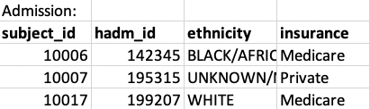
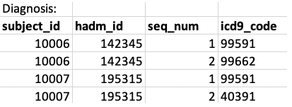
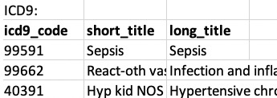
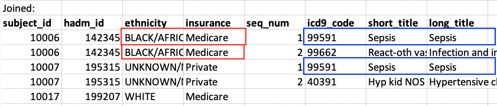
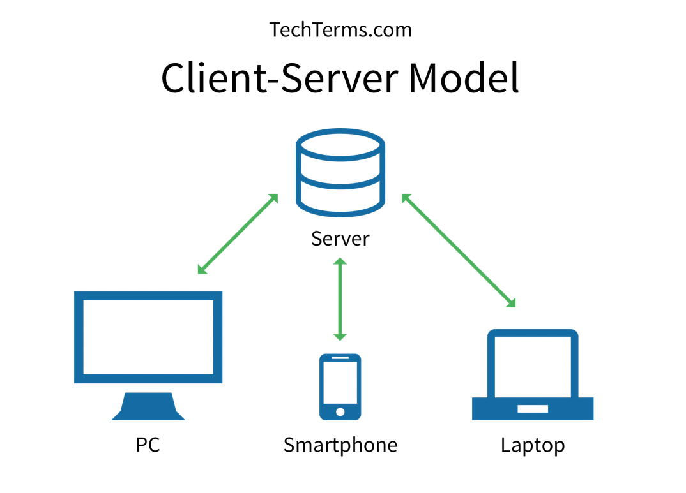

```{r xaringan-tile-view, echo=FALSE}
xaringanExtra::use_tile_view()
knitr::opts_chunk$set(
  fig.width = 6, fig.height = 6
)
```

## Outline

- Overview

- The SQL language

- Indexing

---

## References

- Database System Concepts, 6e by  Silberschatz, Korth, and Sudarshan

---


## What is a database

- A *database* is a large collection of interrelated data tables

- E.g., electronic medical record database [MIMIC](mimic.physionet.org/) includes the following tables (and much more; download the demo dataset [here](demoData.zip))







---

## Why are the existing solutions not enough

- R cannot handle data with size larger than the memory (order of GBs). Data in the memory must be saved to the harddisk so it persists

- An ordinary file on the hard disk, like a csv file, does not support efficient searches (linear but not log-time lookup)

---

## What a database offers

- Efficiency
    - Records are updated and accessed quickly
    - Data have minimal redundancy

- Concurrency
    - A database can be accessed/updated concurrently by many users

- Consistency
    - A record is either updated or not updated, not anywhere in between (atomic)
    - The system will always be in a consistent state even if failure occurs (consistency)

- Security
    - Data are saved on harddisk, so records persists even if the system crashes (durability)
    - Access management: Read/write and more granular accesses

---

## Schemas and instances

- A database *schema* is the metadata for a table describing how it is organized. It contains the *name* of the table, *fields* (columns) and the *data types* 

  - E.g., Diagnosis(sub\_id: int, adm\_id: int, seq\_num: int, icd9\_code: string)

- An *instance* of a schema is a specific collection of rows and columns at a given time

---

## Relational vs non-relational database

- A *relational database* mainly arrange data in tables with rows and columns.
    - Offers rich features for queries and table joins
    - Data must fit on harddisks (Terabytes of data)
    - E.g. of implementations: SQLite, PostgreSQL, and MySQL
    - We focus on relational database in this class

- A *non-relational (noSQL) database* 
    - For storing data and simple lookup queires
    - Scales better to large data than relational database

---

## Database use cases and perspectives

- Statistical analyst: Use database to load a large amount of data that doesn't fit into memory, and preprocess (extract/combine/aggregate) a smaller dataset that fits in the memory

- Application programmer: Use a database to keep track of data (e.g., write a shiny app to collect survey response) or expose a subset of database functions to the users (visualize a certain group of patients)

- Database administrator: Access control and reduce redundancy

---

## Reducing redundancy

- Goals:
    - Preserve information (lossless join)
    - Save space
    - Easy maintanence (update/delete single records)

- E.g. of a redundant table:


---

- A table is said to be in *Boyce-Codd Normal Form (BCNF)* if it is non-redundant in the following sense:
    - if a set of columns determines another column, then the former must be an ID for the entire row (is a superkey)

- Eg of tables in BCNF


---

## Database

A database is often made up of tables representing *entities* and *relations*:

- An *entity* table represents a real-world object. E.g., patients, and the ICD9 descriptions

- A *relationship* table represents the *association* between two or more entities. E.g., admissions, diagnosis

---
class: big, middle

## SQL

---

## Using a database

Most relational databases follow a client-server architecture:



---

## Using database within R

- We will use the `library(DBI)` to interface R with database backends

- `library(RSQLite)` offers a SQLite backend (which runs within the R process and is serverless)

- Create a database on the harddisk:
```{r,eval=FALSE}
library(RSQLite)
db <- dbConnect(RSQLite::SQLite(), "mimicDemo.sqlite")
```

- `dbDisconnect(db)` disconnects a database

- Data for demo is [available here](demoData.zip)

---

## Creating and deleting a table

```
q <- "CREATE TABLE admissionsMini
(
  SUBJECT_ID INT,
  HADM_ID INT,
  ETHNICITY VARCHAR(200),
  INSURANCE VARCHAR(200),
  DIAGNOSIS VARCHAR(200),
  PRIMARY KEY (HADM_ID)
);"
dbExecute(db, q)
```

- Column types must be specified for efficiency of storage

- `VARCHAR(200)` means a string with variable length that is up to 200 characters long

- `dbListTables(db)` shows all available tables in database `db`

- Drop table:

```
DROP TABLE [IF EXISTS] tablename;
```

---

## Key constraints

- Primary key is a constraint that indicates a set of columns must be unique and not null

- The DBMS often creates indices on primary keys, making lookups based on these keys more efficient

---

## Insert into the table

- Insert by specifying the record details
```
INSERT INTO tablename 
VALUES (val1, val2, ..., valp);
```

- E.g.,
```
q <- "INSERT INTO admissionsMini 
  VALUES (9999, 11111, '11/06/22 00:01', 'SEPSIS');"
dbExecute(db, q)
```


Insert from a CSV:
```
dat <- readr::read_csv('demoData/ADMISSIONSmini.csv')
dbWriteTable(db, "admissionsMini", dat, append=TRUE)
```

---

## SQL

- Strctured Query Language (SQL) is a query language, i.e., a language to specify what data operation do you want to perform on the database

- SQL is understood by many database implementations, e.g., PostgreSQL and BigQuery

- R's `library(dplyr)` is designed to be very similar to SQL, so you already know a lot up to difference in syntax

---

```{r, eval=FALSE}
SELECT [DISTINCT] col1, col2, ..., coln
FROM tab1, tab2, ..., tabm
WHERE conditions
ORDER BY col1, col2
LIMIT n1
OFFSET n0;
```

- `SELECT` takes out columns (like `dplyr::select()`)

    - If the `DISTINCT` keyword is specified, then only return distinct rows (like `dplyr::distinct()`)

- `FROM` specifies the tables to select from 
    - A join will be performed if given more than one table. More later

- `WHERE` specifies the selection condition. Only records fulfilling the condition will be returned (like `dplyr::filter()`)

- `ORDER BY` specifies how the returned records should be ordered (like `dplyr::arrange()`)

- `LIMIT n1` returns only the first `n1` records. `OFFSET n0` skips the first `n0` records before returning records

---


- `SELECT *` means extract all columns

- Rename a column/table using `AS`

- `LIKE` for string comparisons: `string LIKE pattern` is true (1) if the former matches the pattern
    - `%` means any sequence of length 0 or more, so `%abc%` matches any string containing `abc` 
    - `_` means any single character

---

## Set operations

- `tab1 UNION tab2` refers to a table that is the union of the two given. Duplicated records will be removed

- `tab1 UNION ALL tab2` gives the union but retaining duplicated records

- `tab1 INTERSECT [ALL] tab2` refers to a table containing records in both `tab1` and `tab2`

- `tab1 EXCEPT [ALL] tab2` refers to a table containing records in onlye `tab1` but not `tab2`

<!-- --- -->

<!-- class: inverse -->

<!-- ## Your turn -->

<!-- - Implement an algorithm the returns all of the elements in an array $A$ that is smaller than $v$ (exclusive). We assume the array $A$ is sorted. $v$ does not have to be an element of $A$ -->

<!-- - Find the time complexity of the algorithm -->

