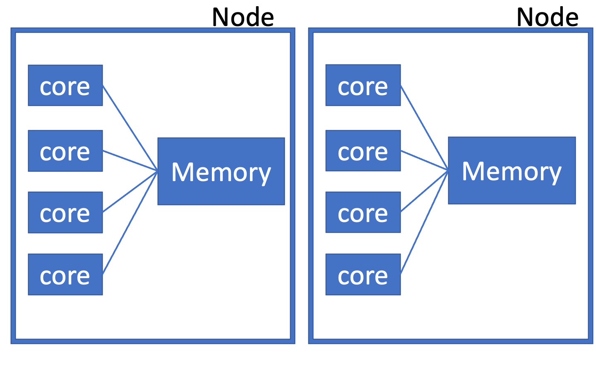

```{r xaringan-tile-view, echo=FALSE}
xaringanExtra::use_tile_view()
knitr::opts_chunk$set(
  fig.width = 6, fig.height = 6
)
```

## Outline

- Basics for parallel computing

- Futures

---

## References

- TODO

---

## Hardware

.center[

]

- A *node* is a physical machine. On an *high performance computing (HPC)* cluster, there are usually multiple nodes, and nodes are interconnected with fast internet
    - This lecture focuses on parallelism on a single machine

- Within each node, multiple *cores/CPUs* are available. They share the same memory
    - Passing information between nodes require special code (message passing interface MPI)

- Sometimes a core may have two (hyper)*threads*. The two threads can better utilize the idle time of a single core. However, this notion is not very useful in parallel computing, and using only 1 thread per core often gives maximal performance
    - "Threads" have different meanings in different contexts. Sometimes it means just cores

---

## How data and results are passed around

Using the terminology in `library(future)`

- `"multisession"`: Launch multiple R sessions. Input data needs to be passed from the main process to the sessions, and results passed back. Available on all systems

- `"multicore"`: Uses `fork` to launch multiple R sessions. The forked sessions share the memory of the main process and thus copies are avoided (more efficient). Not available on Windows/RStudio


---

class: inverse

## Your turn


---

class: big, middle

## Accessing a practical database
