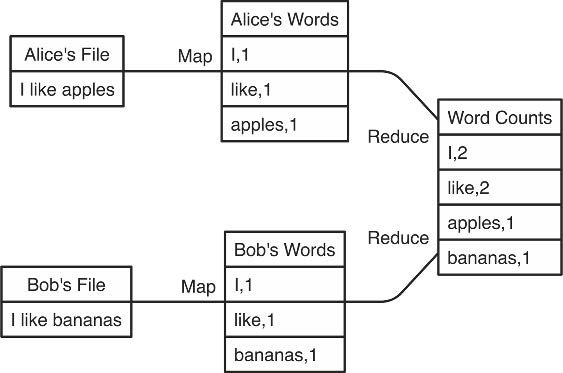
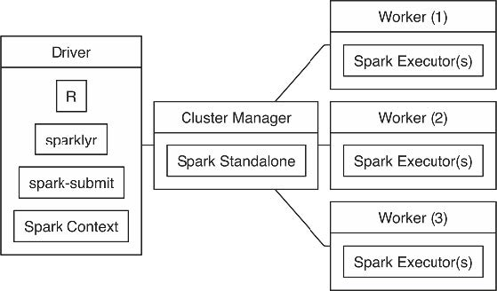

```{r xaringan-tile-view, echo=FALSE}
xaringanExtra::use_tile_view()
knitr::opts_chunk$set(
  fig.width = 6, fig.height = 6, eval=FALSE
)
```

## Outline

- Overview

- Spark for exploratory analysis

- Spark for machine learning

- Spark on a large scale

---

## References

- [Mastering Spark with R](https://therinspark.com/) by Luraschi, Kuo, and Ruiz. (MSR)

- [Spark: The Definitive Guide](https://www.oreilly.com/library/view/spark-the-definitive/9781491912201/) by Chambers and Zaharia
---

## Spark

- Spark is a hugely popular engine for large-scale data processing
    - The original author Matei Zaharia cofounded a company Databricks which has more than 1 billion in revenue in 2022

- Motivation: Deal with *big data* and *big compute* efficiently
    - Big data: Data that cannot fit on a single machine
    - Big compute: Computation that cannot finish quickly on a single machine

- Tasks Spark is good at tackling, for example:
    - Wrangling with and exploring big data
    - Training statistical/machine learning models on big data

---

## Some history

- 2003: Google published a paper on the *Google File System* for storing all information about the webpages 

    - 2004: An approach known as *MapReduce* is used to perform operations across the Google File System
.center[
</br>From MSR
]

---

- 2006: Yahoo open sourced the *Hadoop* project which implements the Google File System as the *Hadoop Distributed File System (HDFS)*
    - Operations are primarily based on hard disks

- 2008: Facebook released the *Hive* project which broughts SQL support to Hadoop

- 2009: *Spark* began as a research project at UC Berkeley's AMPLab. It uses a divide-and-conquer approach like Hadoop but loads data into the memory, making operations much faster than on Hadoop
    - 2010 -- 2013: Open sourced and donated to the Apache Software Foundation

---

## Spark architecture

.center[
</br>From MSR
]

**Hardware**:
- The *driver node* delegates tasks to the *worker nodes* and also collect/aggregate results

---

**Software**:
- The driver process is *R*. More specifically, we will use [sparklyr](https://spark.rstudio.com/) developed by RStudio

- The driver process launches a *spark context* representing the connection to a Spark cluster. Programmers specifies functionalities to perform via this connection (scheduling tasks, managing storages, monitoring and logging, configuring, etc)

- *Spark executors* are the processes responsible for running individual tasks and sending results to the driver

- To make it possible for the executors to work in parallel, Spark breaks data into chunks called *partitions*. A partition is a collection of rows sitting on a machine in the cluster

- There are different cluster managers: Spark Standalone, YARN, and Mesos

---

## Installation & connection

We will use Spark on our local machine this time to start with

- Install [Java 8](https://www.java.com/en/download/) if you don't have it. Issue `java -version` to see the installed version

- Install `sparklyr`: In R, `install.packages("sparklyr")`

- Install Spark: `sparklyr::spark_install("2.3")`

- Connect to a local Spark session:
    ```{r}
    library(sparklyr)
    sc <- spark_connect(master = "local", version = "2.3")
    ```

- When you are done with analysis, issue `spark_disconnect(sc)` to shut down the Spark session

---

class: big, middle

## Exploratory data analysis

---

## Wrangling with data

- Data need to be *imported to the Spark engine* from R or directly from the hard disk
    ```{r}
    cars <- copy_to(sc, mtcars)
    # Or use spark_read_xxx() to read directly from the hard disk
    ```

- The imported data on Spark is a `Dataframe` object. Spark has implemented various methods for this class of objects

- You can specify in R how Spark should deal with the data using either the dplyr syntax, or the SQL syntax, which are equivalent

---

 dplyr:
```{r}
cars %>%
  group_by(cyl) %>% 
  summarize(mean(mpg))
```

SQL:
```{r}
sdf_sql(sc, "SELECT cyl, AVG(mpg) 
             FROM mtcars 
             GROUP BY cyl")
```

- Under the hood, these commands are both translated into Spark SQL statements. We will take the first approach here

- Spark supports a list of Hive functions which can be found [here](https://therinspark.com/appendix.html#hive-functions)
    ```{r}
    cars %>%
      group_by(cyl) %>% 
      summarize(percentile(mpg, 0.9))
    ```

---

class: inverse

## Your turn

- Try to follow the instruction and set up Spark locally

- Run the `mtcars` example

---

## Lazy evaluation

- Spark will hold off evaluation until the very last moment when the result is absolutely needed

- In general, you should pass objects from Spark to R as infrequent as possible. Intermediate results might not fit into the memory and has communication overhead

- `x <- cars %>% group_by(cyl) %>% summarize(mean(mpg))` would only make a plan for the evaluation on Spark, *without* evaluating it. In Spark's language, these steps are *transformations*

- `print(x)` in R will require Spark to evaluate the result

---

- To explicitly ask Spark to evaluate, pipe a statement into...
    - `%>% compute()` creates a temporary table *on Spark* to store the result. Creates a `tbl_spark` in R. Good for inspecting intermediate steps.
    - `%>% collect()` pulls the results to R. Creates a `tbl_df` in R. Only collect smallish results.
    - In Spark's language, these steps are *actions*

---

- Without `compute()`, no actual computation is done:
    ```{r}
    > bench::mark(
        cars %>%
          group_by(cyl) %>% 
          summarize(mean(mpg)), 
        cars %>%
          group_by(cyl) %>% 
          summarize(mean(mpg)) %>%
          compute()
          )
    # A tibble: 2 × 13
      expression                min   median
        <bch:expr>           <bch:tm> <bch:tm>
        1 ...                 7.78ms   8.15ms
        2 ... %>% compute() 150.13ms 151.72ms
    ```

- For debugging purposes, pipe a command into `spark_dataframe() %>% invoke("queryExecution")` to see the evaluation plans make by Spark

---

## Making plots remotely

- `library(dbplot)` allows the creation of plots *remotely* with data from Spark or a database, passing around a minimal amount of data

- The returned plot will be a ggplot in R, so you can decorate it as you wish
    ```{r}
    cars %>%
      dbplot_histogram(mpg, binwidth = 3) %>%
      ggtitle("mpg")

    cars %>%
      dbplot_raster(cars, mpg, wt, resolution = 5) # 2D hist
    ```

---

## High-level functions

- `sdf_describe()` computes numerical summaries

- `sdf_crosstab()` computes a cross-tabulation of two columns

- `sdf_rnorm()` etc creates a Spark Dataframe containing a single column of random numbers. Useful together with `sdf_bind_cols()`

---

## Machine learning functions

- `ml_linear_regression()` fits a linear regression regularized by the elastic net penalty

- `sdf_random_split()` partitions data into train and test sets

- `ml_evaluate()` computes performance metrics

E.g., 
```{r}
m <- split$train %>%
  ml_linear_regression(mpg ~ ., 
                       elastic_net_param = 1, # lasso
                       reg_param = 0.5)

ev <- ml_evaluate(m, split$test)
names(ev)
ev$predictions %>%
  print(width=Inf)
```

---

## Monitoring spark

- `spark_web(sc)` opens a browser for monitoring Spark status. Same as visiting `http://localhost:4040` in your browser

- `spark_log(sc)` shows the logs


